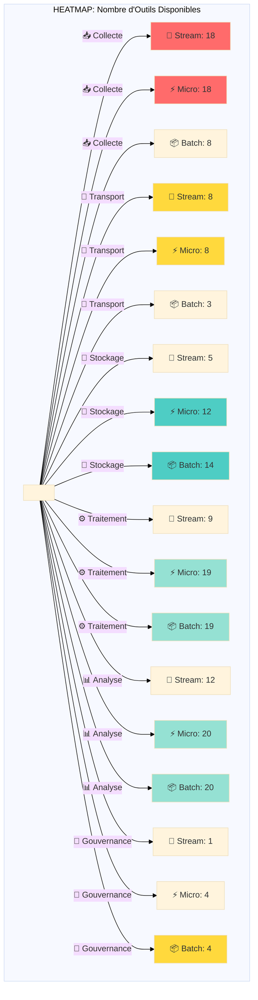
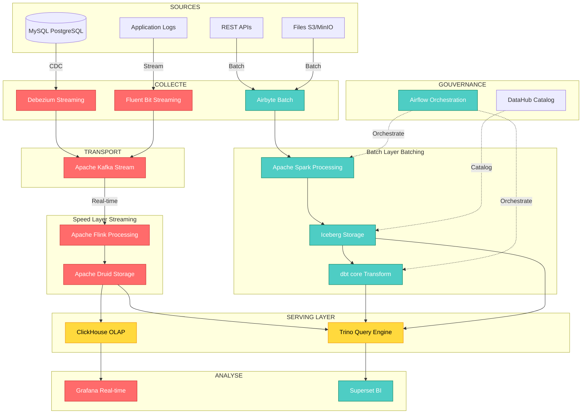
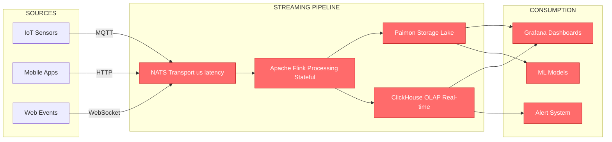
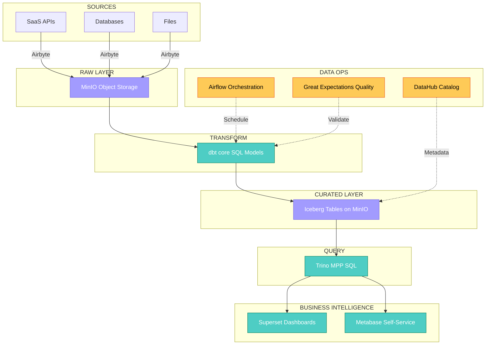
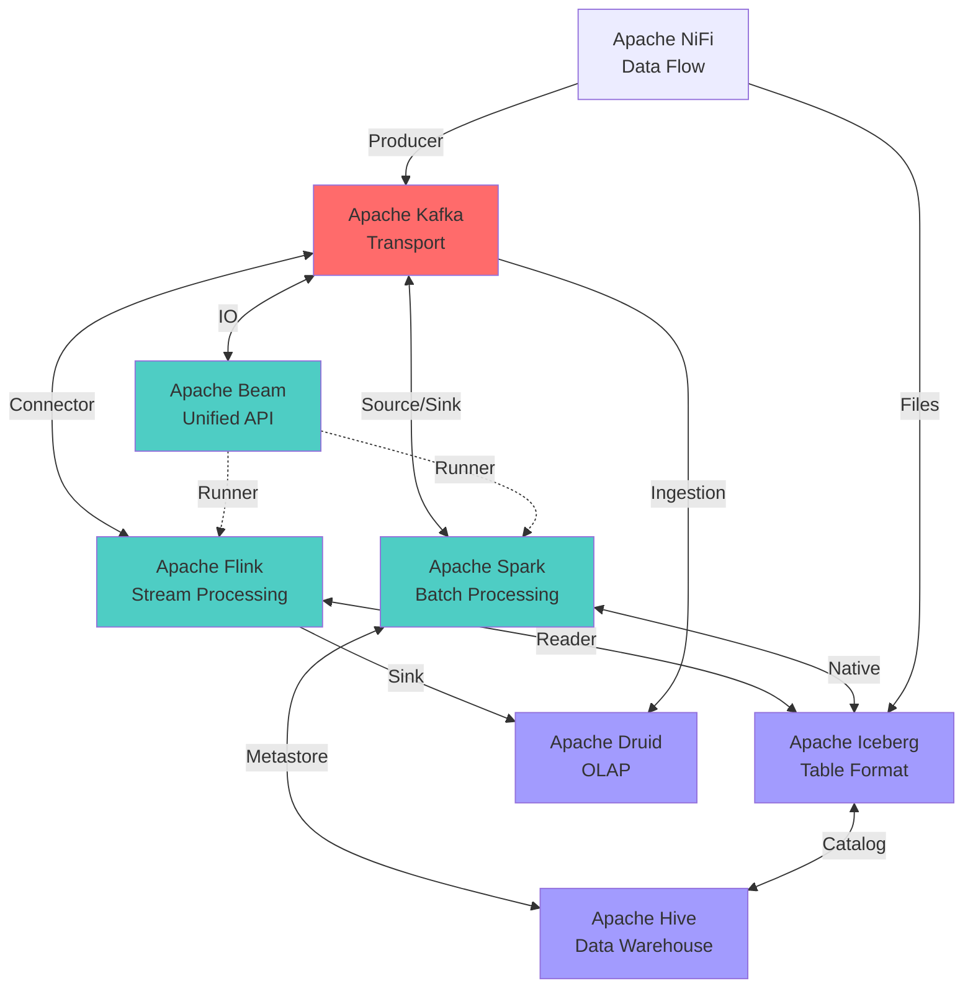
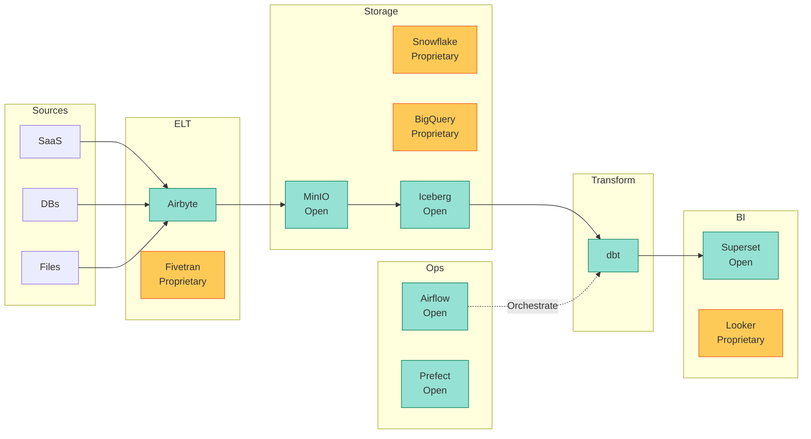

# Visualisations - Classification Flux × Fonction

> **Objectif:** Proposer des visualisations interactives et diagrammes pour faciliter la compréhension de la classification bidimensionnelle.

---

## 📊 Table des Matières

1. [Heatmap Globale Flux × Fonction](#1-heatmap-globale)
2. [Diagrammes de Pipeline par Stack](#2-diagrammes-de-pipeline)
3. [Graphiques en Radar - Versatilité](#3-graphiques-radar)
4. [Sankey Diagrams - Flow de Données](#4-sankey-diagrams)
5. [Timeline - Évolution Temporelle](#5-timeline)
6. [Arbres de Décision Interactifs](#6-arbres-de-décision)
7. [Network Graphs - Écosystèmes](#7-network-graphs)
8. [Dashboards Recommandés](#8-dashboards-interactifs)

---

## 1. 🔥 Heatmap Globale Flux × Fonction

### Heatmap 1 : Nombre d'Outils par Cellule



### ASCII Heatmap avec Intensité

```
HEATMAP: Densité d'Outils (Flux × Fonction)
═══════════════════════════════════════════════════════════════

              │ Collecte │Transport│ Stockage│Traitement│ Analyse │Gouvernance│
──────────────┼──────────┼─────────┼─────────┼──────────┼─────────┼───────────┤
🌊 Streaming  │   ████   │   ███   │    █    │    ██    │   ███   │     ▓     │
              │    18    │    8    │    5    │    9     │   12    │     1     │
──────────────┼──────────┼─────────┼─────────┼──────────┼─────────┼───────────┤
⚡Micro-Batch │   ████   │   ███   │   ███   │   ████   │   ████  │    ██     │
              │    18    │    8    │   12    │    19    │   20    │     4     │
──────────────┼──────────┼─────────┼─────────┼──────────┼─────────┼───────────┤
📦 Batching   │   ██     │    █    │   ████  │   ████   │   ████  │    ██     │
              │    8     │    3    │   14    │    19    │   20    │     4     │
──────────────┴──────────┴─────────┴─────────┴──────────┴─────────┴───────────┘

Légende Intensité: ▓ (1-5) █ (5-10) ██ (10-15) ███ (15-20) ████ (20+)

🔴 Zone Rouge (< 5 outils)   : Faible couverture
🟡 Zone Jaune (5-10 outils)  : Couverture moyenne
🟢 Zone Verte (10-20 outils) : Bonne couverture
🔵 Zone Bleue (> 20 outils)  : Excellente couverture
```

---

## 2. 📈 Diagrammes de Pipeline par Stack

### Architecture Lambda - Vue Détaillée



### Architecture Kappa - Streaming Only



### Modern Data Stack - Batch + BI



---

## 3. 🎯 Graphiques Radar - Versatilité des Outils

### Radar 1 : Apache Spark (Multi-Mode)

```
        Collecte (0/3)
               |
               |
Gouvernance    |      Transport (0/3)
    (0/3)      |     /
         \     |   /
           \   | /
             \ |/
    ──────────●──────────
             /|\
           /  |  \
         /    |    \
    (2/3)     |      (3/3)
 Analyse      |      Stockage
              |
              |
        Traitement (3/3)

Score Total: 8/18 = 44%
Spécialité: Traitement (Batch + Micro-Batch + léger Streaming)
```

### Radar 2 : Apache NiFi (Polyvalent)

```
        Collecte (3/3)
               |
               |
Gouvernance    |      Transport (3/3)
    (2/3)      |     /
         \     |   /
           \   | /
             \ |/
    ──────────●──────────
             /|\
           /  |  \
         /    |    \
    (1/3)     |      (2/3)
 Analyse      |      Stockage
              |
              |
        Traitement (2/3)

Score Total: 13/18 = 72%
Spécialité: Swiss Army Knife (Excellence Collecte + Transport)
```

### Radar 3 : Grafana (Spécialisé)

```
        Collecte (0/3)
               |
               |
Gouvernance    |      Transport (0/3)
    (1/3)      |     /
         \     |   /
           \   | /
             \ |/
    ──────────●──────────
             /|\
           /  |  \
         /    |    \
    (3/3)     |      (0/3)
 Analyse      |      Stockage
              |
              |
        Traitement (0/3)

Score Total: 4/18 = 22%
Spécialité: Excellence Analyse (Monitoring/Dashboards)
```

### Comparaison Top 5 Outils (Format Tableau)

```
═══════════════════════════════════════════════════════════════════════════
                    VERSATILITÉ DES OUTILS (Score sur 18)
═══════════════════════════════════════════════════════════════════════════
Outil           │Collecte│Transport│Stockage│Traitement│Analyse│Gouvernance│Total
────────────────┼────────┼─────────┼────────┼──────────┼───────┼───────────┼─────
Apache NiFi     │  ███   │   ███   │   ██   │    ██    │   █   │    ██     │ 13
Apache Kafka    │  ██    │   ███   │   █    │    ██    │   ▓   │     ▓     │ 10
Apache Spark    │  ▓     │    ▓    │   ██   │   ███    │   ██  │     ▓     │  9
ClickHouse      │  ▓     │    ▓    │  ███   │   ███    │   ██  │     ▓     │ 10
Grafana         │  ▓     │    ▓    │   ▓    │    ▓     │  ███  │     █     │  8
────────────────┴────────┴─────────┴────────┴──────────┴───────┴───────────┴─────

Légende: ▓ (0.5) █ (1) ██ (2) ███ (3)
```

---

## 4. 🌊 Sankey Diagrams - Flow de Données

### Sankey 1 : Distribution des Outils par Flux → Fonction

```
                                    ┌─→ Collecte (18) ────┐
                                    │                      │
              ┌─────────────────────┤                      │
              │   Streaming (53)    ├─→ Transport (8) ─────┤
              │                     │                      │
              │                     ├─→ Stockage (5) ──────┤
              │                     │                      │
              │                     ├─→ Traitement (9) ────┤
              │                     │                      ├──→ Total: 139 outils
              │                     ├─→ Analyse (12) ──────┤
              │                     │                      │
              │                     └─→ Gouvernance (1) ───┤
              │                                            │
139 Solutions ┤                     ┌─→ Collecte (18) ────┤
              │                     │                      │
              ├─────────────────────┤                      │
              │ Micro-Batch (81)    ├─→ Transport (8) ─────┤
              │                     │                      │
              │                     ├─→ Stockage (12) ─────┤
              │                     │                      │
              │                     ├─→ Traitement (19) ───┤
              │                     │                      │
              │                     ├─→ Analyse (20) ──────┤
              │                     │                      │
              │                     └─→ Gouvernance (4) ───┤
              │                                            │
              │                     ┌─→ Collecte (8) ─────┤
              │                     │                      │
              └─────────────────────┤                      │
                  Batching (68)     ├─→ Transport (3) ─────┤
                                    │                      │
                                    ├─→ Stockage (14) ─────┤
                                    │                      │
                                    ├─→ Traitement (19) ───┤
                                    │                      │
                                    ├─→ Analyse (20) ──────┤
                                    │                      │
                                    └─→ Gouvernance (4) ───┘

Insights:
- Micro-Batch = meilleure couverture (81 combinaisons)
- Streaming faible en Gouvernance (1 seul outil)
- Batch excellente couverture Stockage (14 outils)
```

### Sankey 2 : Journey d'un Event dans Lambda Architecture

```
Event Source
     │
     ├──────────────────────────────────────┐
     │                                      │
     ▼                                      ▼
[Speed Path - Streaming]           [Batch Path - Batching]
     │                                      │
     ├─→ Debezium (Collecte)                ├─→ Airbyte (Collecte)
     │       ↓                               │       ↓
     ├─→ Kafka (Transport)                   │   (pas de transport)
     │       ↓                               │       ↓
     ├─→ Flink (Traitement)                  ├─→ Spark (Traitement)
     │       ↓                               │       ↓
     ├─→ Druid (Stockage)                    ├─→ Iceberg (Stockage)
     │       ↓                               │       ↓
     │       └────────────┐                  ├─→ dbt (Traitement)
     │                    │                  │       ↓
     │                    ▼                  │       │
     │              ┌──────────┐             │       │
     └──────────────┤  Trino   │◄────────────┘       │
                    │ (Query)  │                     │
                    └────┬─────┘                     │
                         │                           │
                    ┌────┴─────┐                     │
                    ▼          ▼                     │
               Grafana    Superset◄──────────────────┘
            (Real-time)     (BI)

Latence:
- Speed Path: 100ms - 1s
- Batch Path: 1h - 24h
```

---

## 5. 📅 Timeline - Évolution Temporelle

### Timeline 1 : Maturation par Flux (2010-2025)

```
2010 │
     │  📦 BATCH ERA
     │  ━━━━━━━━━━━━━━━━━━━━━━━━━━━━━━━━━━━━━━━━━━━━━━━━━━━━━
     │  Hadoop, Hive, Spark dominance
     │
2015 │                    🌊 STREAMING EMERGENCE
     │                    ━━━━━━━━━━━━━━━━━━━━━━━━━━━━━━━━━━━
     │                    Kafka, Flink, Storm maturation
     │
2018 │                              ⚡ MICRO-BATCH STANDARDIZATION
     │                              ━━━━━━━━━━━━━━━━━━━━━━━━━━━━
     │                              Spark Structured Streaming
     │                              Delta Lake, Iceberg
     │
2020 │                                        🔄 CONVERGENCE
     │                                        ━━━━━━━━━━━━━━━━━━
     │                                        Unified APIs (Beam)
     │                                        Hudi, Paimon
     │
2025 │                                                  🚀 PRESENT
     │  📦 Batch: Mature                                ▲
     │  ⚡ Micro: Standard
     │  🌊 Stream: Growing

Tendance: Unification Batch + Streaming dans une seule stack
```

### Timeline 2 : Émergence des Fonctions

```
2010 ├─────────────────────────────────────────────────────→ 2025
     │
💾   │████████████████████████████████████████████ Storage
     │   (Mature depuis le début)
     │
⚙️   │████████████████████████████████████████████ Traitement
     │   (Batch puis Streaming)
     │
📥   │██████████████████████████████░░░░░░░░░░░░░░ Collecte
     │   (CDC récent, 2016+)
     │
🚚   │█████████████████████░░░░░░░░░░░░░░░░░░░░░░░ Transport
     │   (Kafka 2011, explosion 2015+)
     │
📊   │████████████████████████████████░░░░░░░░░░░░ Analyse
     │   (BI classique, real-time récent)
     │
🔐   │░░░░░░░░░░░░░░░░░░░░░░░████████████████████ Gouvernance
     │   (Émergence tardive, 2018+)

Légende: █ Mature  ░ En développement
```

---

## 6. 🌳 Arbres de Décision Interactifs

### Arbre 1 : Sélection d'Outil de Traitement

```
                          Quelle latence requise?
                                    │
                ┌───────────────────┼───────────────────┐
                │                   │                   │
           < 1 seconde         1s - 5 min           > 5 minutes
         (🌊 Streaming)      (⚡ Micro-Batch)       (📦 Batching)
                │                   │                   │
        ┌───────┴────────┐   ┌──────┴──────┐   ┌───────┴────────┐
        │                │   │             │   │                │
   Stateful?         Simple?  Volume?   Simple?  SQL?        Python?
        │                │   │             │   │                │
    ┌───┴───┐        ┌───┴───┐         ┌───┴───┐          ┌────┴────┐
    │       │        │       │         │       │          │         │
   Oui     Non      Oui     Non       Oui     Non        Oui       Non
    │       │        │       │         │       │          │         │
  Flink  Storm  Materialize Kafka   Spark    Beam       dbt      Spark
                           Streams  Streaming          core

Recommandations finales:
━━━━━━━━━━━━━━━━━━━━━━
🌊 Stateful complex    → Apache Flink
🌊 Simple streaming    → Kafka Streams, Materialize
⚡ High throughput     → Spark Structured Streaming
⚡ Lightweight          → DuckDB, Polars
📦 SQL transformations → dbt core
📦 Complex pipelines   → Apache Spark, Beam
```

### Arbre 2 : Sélection de Stack Complète

```
                        Quel est votre besoin principal?
                                     │
              ┌──────────────────────┼──────────────────────┐
              │                      │                      │
        Alertes Temps Réel    Dashboards Business    Data Warehouse
         (Latence < 1s)        (Refresh 1-5min)       (Batch Daily)
              │                      │                      │
              │                      │                      │
      STACK STREAMING           STACK MICRO-BATCH       STACK BATCHING
              │                      │                      │
              ▼                      ▼                      ▼
    ┌─────────────────┐    ┌─────────────────┐    ┌─────────────────┐
    │ Collecte: CDC   │    │ Collecte: NiFi  │    │ Collecte:Airbyte│
    │ Transport: Kafka│    │ Transport: Kafka│    │ Storage: Iceberg│
    │ Process: Flink  │    │ Process: Spark  │    │ Transform: dbt  │
    │ Storage: Druid  │    │ Storage: DeltaLk│    │ Query: Trino    │
    │ Analyse: Grafana│    │ Query: StarRocks│    │ BI: Superset    │
    │ Ops: Kestra     │    │ BI: Superset    │    │ Ops: Airflow    │
    └─────────────────┘    │ Ops: Airflow    │    └─────────────────┘
                           └─────────────────┘

Temps de mise en place estimé:
━━━━━━━━━━━━━━━━━━━━━━━━━━━━
🌊 Streaming: 4-6 mois (complexité haute)
⚡ Micro-Batch: 2-3 mois (compromis)
📦 Batching: 1-2 mois (well-known patterns)
```

---

## 7. 🕸️ Network Graphs - Écosystèmes

### Graph 1 : Écosystème Apache (Compatibilité)



### Graph 2 : Écosystème Modern Data Stack



---

## 8. 📊 Dashboards Interactifs Recommandés

### Dashboard 1 : Vue Globale (Recommandé: Superset)

```
┌─────────────────────────────────────────────────────────────────┐
│  CLASSIFICATION FLUX × FONCTION - Vue d'Ensemble                │
├─────────────────────────────────────────────────────────────────┤
│                                                                 │
│  [Heatmap]              [Bar Chart]          [Pie Chart]        │
│  Flux × Fonction        Top 10 Outils       Distribution Flux   │
│  ┌──────────────┐      ┌──────────────┐    ┌──────────────┐   │
│  │   18 8  5    │      │ NiFi    ████ │    │   🌊 38%     │   │
│  │   18 8  12   │      │ Kafka   ███  │    │   ⚡ 44%     │   │
│  │   8  3  14   │      │ Spark   ███  │    │   📦 18%     │   │
│  └──────────────┘      └──────────────┘    └──────────────┘   │
│                                                                 │
│  [Line Chart - Timeline]                    [Radar Chart]      │
│  Évolution 2010-2025                        Versatilité Top 5  │
│  ┌───────────────────────────────────────┐  ┌──────────────┐  │
│  │            ╱────────                   │  │    Collecte  │  │
│  │       ╱────                            │  │   ╱│╲       │  │
│  │   ╱───                                 │  │  ╱ │ ╲      │  │
│  │ ──                                     │  │ ●──●──●     │  │
│  └───────────────────────────────────────┘  └──────────────┘  │
│                                                                 │
│  [Table - Leaders]                                              │
│  ┌───────────────────────────────────────────────────────────┐│
│  │ Fonction   │ Streaming      │ Micro-Batch  │ Batching    ││
│  ├────────────┼────────────────┼──────────────┼─────────────┤│
│  │ Collecte   │ Debezium       │ NiFi         │ Airbyte     ││
│  │ Transport  │ Kafka          │ Kafka        │ NiFi        ││
│  │ Storage    │ Hudi           │ Delta Lake   │ Iceberg     ││
│  └───────────────────────────────────────────────────────────┘│
└─────────────────────────────────────────────────────────────────┘

Filtres Dynamiques:
☐ Streaming  ☐ Micro-Batching  ☐ Batching
☐ Collecte   ☐ Transport       ☐ Stockage   ☐ Traitement  ☐ Analyse  ☐ Gouvernance
```

### Dashboard 2 : Comparateur d'Outils (Recommandé: Streamlit)

```python
# Streamlit App Concept
import streamlit as st

st.title("🔍 Comparateur d'Outils Data")

col1, col2 = st.columns(2)

with col1:
    tool1 = st.selectbox("Outil 1", ["Apache Spark", "Apache Flink", ...])

with col2:
    tool2 = st.selectbox("Outil 2", ["Apache Beam", "dbt core", ...])

# Radar chart comparison
st.subheader("Comparaison Multi-Critères")
radar_data = {
    'Collecte': [tool1_scores, tool2_scores],
    'Transport': [...],
    ...
}
st.plotly_chart(create_radar(radar_data))

# Feature matrix
st.subheader("Matrice de Compatibilité")
comparison_df = pd.DataFrame({
    'Critère': ['Streaming', 'Micro-Batch', 'Batching', ...],
    tool1: ['🟢', '🟡', '🟢', ...],
    tool2: ['🟢', '🟢', '⚪', ...]
})
st.dataframe(comparison_df)

# Use cases recommandés
st.subheader("Use Cases Recommandés")
st.info(f"{tool1}: Idéal pour {use_cases_tool1}")
st.info(f"{tool2}: Idéal pour {use_cases_tool2}")
```

### Dashboard 3 : Architecture Builder (Recommandé: Grafana + Custom)

```
┌─────────────────────────────────────────────────────────────────┐
│  🏗️ ARCHITECTURE BUILDER - Sélection Interactive               │
├─────────────────────────────────────────────────────────────────┤
│                                                                 │
│  Étape 1: Sélectionnez vos contraintes                         │
│  ┌───────────────────────────────────────────────────────────┐ │
│  │ Latence requise: [  < 1s  ] [1s-5min] [> 5min]           │ │
│  │ Volume quotidien: [ < 10GB ] [ 10-100GB ] [ > 100GB ]    │ │
│  │ Compétences équipe: [ Débutant ] [ Intermédiaire ] ...   │ │
│  └───────────────────────────────────────────────────────────┘ │
│                                                                 │
│  Étape 2: Architecture Recommandée                             │
│  ┌───────────────────────────────────────────────────────────┐ │
│  │                                                           │ │
│  │   Sources → [Collecte] → [Transport] → [Traitement]      │ │
│  │                ↓            ↓              ↓             │ │
│  │            Debezium     Kafka          Flink             │ │
│  │                                          ↓               │ │
│  │              [Stockage] ← [Query] ← [Analyse]           │ │
│  │                  ↓           ↓          ↓               │ │
│  │                Hudi       Trino      Grafana            │ │
│  │                                                           │ │
│  └───────────────────────────────────────────────────────────┘ │
│                                                                 │
│  Étape 3: Détails et Alternatives                              │
│  ┌───────────────────────────────────────────────────────────┐ │
│  │ Collecte (Debezium)                                       │ │
│  │ • Stars: 12,088                                           │ │
│  │ • Latence: < 100ms                                        │ │
│  │ • Alternative: Maxwell (MySQL only)                       │ │
│  │ [Documentation] [Tutoriels] [Docker Compose]             │ │
│  └───────────────────────────────────────────────────────────┘ │
│                                                                 │
│  [Exporter Architecture] [Comparer avec Alternative]           │
└─────────────────────────────────────────────────────────────────┘
```

---

## 9. 📉 Graphiques Statistiques Supplémentaires

### Distribution des Outils par Fonction (Bar Chart)

```
Nombre d'Outils par Fonction
━━━━━━━━━━━━━━━━━━━━━━━━━━━

Analyse       ████████████████████  (28)
Traitement    ███████████████████   (24)
Stockage      ███████████████       (15)
Collecte      ██████████████        (18)
Transport     ████████              (8)
Gouvernance   ████                  (8)

              0   5   10  15  20  25  30
```

### Distribution par Flux (Pie Chart ASCII)

```
         Distribution des Combinaisons Outil-Flux
                    (Total: 202)

              📦 Batching
               68 (34%)
                  ╱│╲
                ╱  │  ╲
              ╱    │    ╲
            ╱      │      ╲
          ╱   ⚡   │   🌊   ╲
        ╱    Micro │ Stream  ╲
      ╱     81(40%)│ 53(26%)  ╲
    ╱              │            ╲
   └───────────────┴─────────────┘

Insight: Micro-Batching = meilleure couverture
```

### Évolution du Nombre d'Outils (Area Chart)

```
Nombre d'Outils Disponibles par Année
━━━━━━━━━━━━━━━━━━━━━━━━━━━━━━━━━━━
150 │                              ╱────
    │                         ╱────
    │                    ╱────
100 │               ╱────
    │          ╱────
    │     ╱────
 50 │╱────                    [Batch]
    │                         [Stream]
    │                         [Micro]
  0 └────┬────┬────┬────┬────┬────┬────
      2010  2013  2016  2019  2022  2025

Phase 1 (2010-2015): Batch dominance
Phase 2 (2015-2020): Streaming emergence
Phase 3 (2020-2025): Convergence & Micro-batch
```

---

## 10. 🎨 Suggestions d'Implémentation

### Option 1 : Static Site avec Mermaid.js

**Technologies:**
- Markdown + Mermaid.js
- GitHub Pages ou Netlify
- Responsive design

**Avantages:**
- Facile à maintenir
- Version control Git
- Gratuit
- Diagrammes rendus côté client

**Exemple repo structure:**
```
/docs
  /diagrams
    - lambda-architecture.mmd
    - kappa-architecture.mmd
  /visualizations
    - heatmap.html
    - radar.html
  index.html
  styles.css
```

---

### Option 2 : Dashboard Streamlit

**Technologies:**
- Python + Streamlit
- Plotly pour graphiques interactifs
- Pandas pour data manipulation

**Avantages:**
- Très interactif
- Prototypage rapide
- Filtres dynamiques
- Easy deployment (Streamlit Cloud)

**Code example:**
```python
import streamlit as st
import plotly.express as px
import pandas as pd

# Load classification data
df = pd.read_csv('classification_data.csv')

# Sidebar filters
flux = st.sidebar.multiselect('Flux', ['Streaming', 'Micro-Batch', 'Batching'])
fonction = st.sidebar.multiselect('Fonction', ['Collecte', 'Transport', ...])

# Main viz
fig = px.density_heatmap(df, x='Fonction', y='Flux', z='Count')
st.plotly_chart(fig)
```

---

### Option 3 : Superset Dashboard

**Technologies:**
- Apache Superset
- PostgreSQL backend
- Custom CSS themes

**Avantages:**
- Enterprise-grade BI
- SQL-based
- Role-based access
- Scheduled reports

**Setup:**
```sql
-- Create classification table
CREATE TABLE tool_classification (
    tool_name VARCHAR(100),
    fonction VARCHAR(50),
    flux VARCHAR(50),
    score INT,
    ...
);

-- Superset can query directly
```

---

### Option 4 : Observable Notebook

**Technologies:**
- Observable (https://observablehq.com)
- D3.js pour custom viz
- JavaScript reactive

**Avantages:**
- Très flexible
- Communauté forte
- Partage facile
- Real-time collaboration

**Example cell:**
```javascript
// Interactive heatmap
viewof selection = Plot.plot({
  marks: [
    Plot.cell(data, {
      x: "fonction",
      y: "flux",
      fill: "count",
      tip: true
    })
  ],
  color: {scheme: "Blues"}
})
```

---

## 🎯 Recommandation Finale

### Pour Documentation Statique:
**➡️ Mermaid.js + GitHub Pages**
- Intégration facile avec Markdown
- Pas de backend nécessaire
- Version control natif
- Excellent pour README et docs

### Pour Analyse Interactive:
**➡️ Streamlit App**
- Prototypage rapide
- Interactivité native
- Easy updates
- Free hosting sur Streamlit Cloud

### Pour Visualisation Avancée:
**➡️ Observable Notebook**
- Flexibilité D3.js
- Sharing facile
- Reactive programming
- Belles visualisations

---

## 📚 Ressources et Outils

### Générateurs de Diagrammes

| Outil | Type | Use Case | Lien |
|-------|------|----------|------|
| **Mermaid** | Diagrammes code | Flowcharts, Gantt, Sankey | https://mermaid.js.org |
| **PlantUML** | UML diagrams | Architecture, sequence | https://plantuml.com |
| **draw.io** | Visual editor | Tous types | https://draw.io |
| **Excalidraw** | Hand-drawn | Sketches, wireframes | https://excalidraw.com |

### Librairies Visualisation

| Librairie | Langage | Spécialité | Lien |
|-----------|---------|-----------|------|
| **Plotly** | Python/JS | Interactive charts | https://plotly.com |
| **D3.js** | JavaScript | Custom viz | https://d3js.org |
| **Vega-Lite** | JSON spec | Declarative | https://vega.github.io |
| **Apache ECharts** | JavaScript | Enterprise | https://echarts.apache.org |

### Dashboarding

| Plateforme | Open Source | Complexité | Best For |
|------------|-------------|------------|----------|
| **Streamlit** | ✅ | Faible | Prototypage rapide |
| **Dash** | ✅ | Moyenne | Production apps |
| **Superset** | ✅ | Élevée | Enterprise BI |
| **Grafana** | ✅ | Moyenne | Monitoring |

---

## ✅ Checklist Implémentation

### Phase 1: Diagrammes Statiques (Semaine 1)
- [ ] Convertir heatmaps en Mermaid
- [ ] Créer flowcharts architectures
- [ ] Générer radars de versatilité
- [ ] Intégrer dans 07.matrice_flux_fonction.md

### Phase 2: Visualisations Interactives (Semaine 2)
- [ ] Setup Streamlit app
- [ ] Créer heatmap interactive avec filtres
- [ ] Ajouter comparateur d'outils
- [ ] Builder d'architecture

### Phase 3: Dashboards Avancés (Semaine 3-4)
- [ ] Setup Superset instance
- [ ] Créer cubes de données
- [ ] Développer 3-5 dashboards clés
- [ ] Configurer alertes et exports

### Phase 4: Documentation (Semaine 4)
- [ ] Tutoriel d'utilisation
- [ ] Guide de contribution
- [ ] Exemples use cases
- [ ] Video walkthrough

---

**Document créé le:** 2025-12-09
**Dernière mise à jour:** 2025-12-09
**Version:** 1.0
**Statut:** ✅ Complet - 10 types de visualisations proposées
