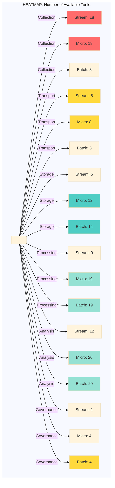
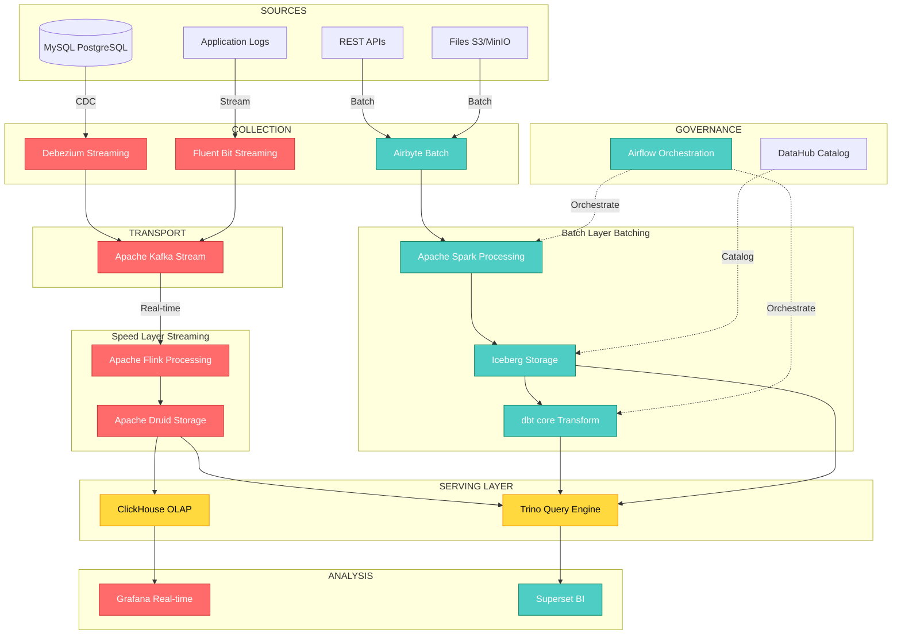
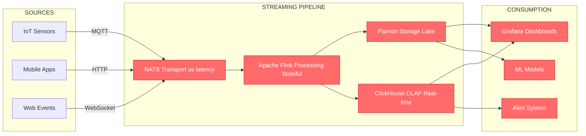
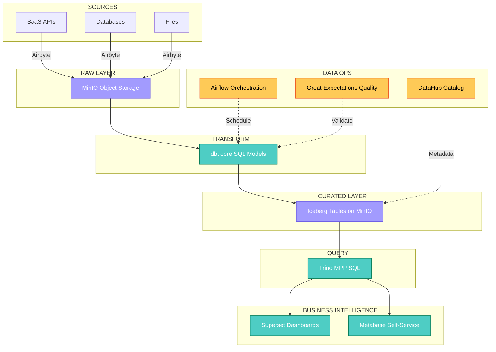
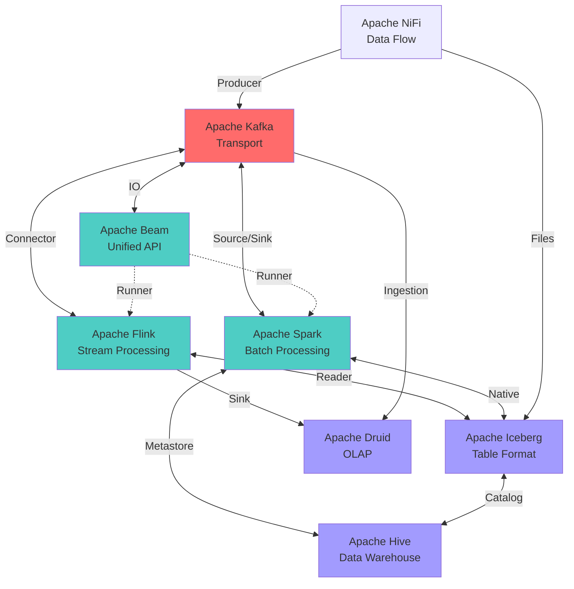
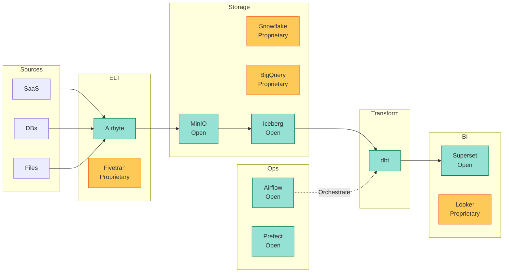

# Visualizations - Flow × Function Classification

> **Reference interactive view**: a site generated automatically from
> catalogs 01-05 lets you filter/sort all solutions (stars, dates, licenses,
> top/flop, recent/old) → folder `docs/` (GitHub Pages). The diagrams below
> are editorial views; for exact and up-to-date counts, refer to the site.

> **Objective:** Provide interactive visualizations and diagrams to facilitate understanding of the two-dimensional classification.

---

## Table of Contents

1. [Global Heatmap Flow × Function](#1-global-heatmap-flow-function)
2. [Pipeline Diagrams by Stack](#2-pipeline-diagrams-by-stack)
3. [Radar Charts - Tool Versatility](#3-radar-charts-tool-versatility)
4. [Sankey Diagrams - Data Flow](#4-sankey-diagrams-data-flow)
5. [Timeline - Temporal Evolution](#5-timeline-temporal-evolution)
6. [Interactive Decision Trees](#6-interactive-decision-trees)
7. [Network Graphs - Ecosystems](#7-network-graphs-ecosystems)
8. [Recommended Dashboards](#8-recommended-dashboards)

---

## 1. Global Heatmap Flow × Function

### Heatmap 1: Number of Tools per Cell

> _(indicative figures — see the site for exact counts)_


```mermaid
%%{init: {'theme':'base'}}%%
graph TD
    subgraph "HEATMAP: Number of Available Tools"
        A[" "] -->|" Collection"| B1[" Stream: 18"]
        A -->|" Collection"| B2[" Micro: 18"]
        A -->|" Collection"| B3[" Batch: 8"]

        A -->|" Transport"| C1[" Stream: 8"]
        A -->|" Transport"| C2[" Micro: 8"]
        A -->|" Transport"| C3[" Batch: 3"]

        A -->|" Storage"| D1[" Stream: 5"]
        A -->|" Storage"| D2[" Micro: 12"]
        A -->|" Storage"| D3[" Batch: 14"]

        A -->|" Processing"| E1[" Stream: 9"]
        A -->|" Processing"| E2[" Micro: 19"]
        A -->|" Processing"| E3[" Batch: 19"]

        A -->|" Analysis"| F1[" Stream: 12"]
        A -->|" Analysis"| F2[" Micro: 20"]
        A -->|" Analysis"| F3[" Batch: 20"]

        A -->|" Governance"| G1[" Stream: 1"]
        A -->|" Governance"| G2[" Micro: 4"]
        A -->|" Governance"| G3[" Batch: 4"]
    end

    style B1 fill:#ff6b6b
    style B2 fill:#ff6b6b
    style C1 fill:#ffd93d
    style C2 fill:#ffd93d
    style D2 fill:#4ecdc4
    style D3 fill:#4ecdc4
    style E2 fill:#95e1d3
    style E3 fill:#95e1d3
    style F2 fill:#95e1d3
    style F3 fill:#95e1d3
    style G3 fill:#ffd93d
```

### ASCII Heatmap with Intensity

> _(indicative figures — see the site for exact counts)_

```
HEATMAP: Tool Density (Flow × Function)
═══════════════════════════════════════════════════════════════

              │Collection│Transport│ Storage │Processing│Analysis│Governance │
──────────────┼──────────┼─────────┼─────────┼──────────┼─────────┼───────────┤
 Streaming  │   ████   │   ███   │    █    │    ██    │   ███   │     ▓     │
              │    18    │    8    │    5    │    9     │   12    │     1     │
──────────────┼──────────┼─────────┼─────────┼──────────┼─────────┼───────────┤
Micro-Batch │   ████   │   ███   │   ███   │   ████   │   ████  │    ██     │
              │    18    │    8    │   12    │    19    │   20    │     4     │
──────────────┼──────────┼─────────┼─────────┼──────────┼─────────┼───────────┤
 Batching   │   ██     │    █    │   ████  │   ████   │   ████  │    ██     │
              │    8     │    3    │   14    │    19    │   20    │     4     │
──────────────┴──────────┴─────────┴─────────┴──────────┴─────────┴───────────┘

Intensity Legend: ▓ (1-5) █ (5-10) ██ (10-15) ███ (15-20) ████ (20+)

 Red Zone (< 5 tools)    : Low coverage
◐ Yellow Zone (5-10 tools) : Medium coverage
● Green Zone (10-20 tools) : Good coverage
 Blue Zone (> 20 tools)  : Excellent coverage
```

---

## 2. Pipeline Diagrams by Stack

### Lambda Architecture - Detailed View


```mermaid
flowchart TB
    subgraph Sources["SOURCES"]
        DB[("MySQL PostgreSQL")]
        API["REST APIs"]
        FILES["Files S3/MinIO"]
        LOGS["Application Logs"]
    end

    subgraph Collecte["COLLECTION"]
        CDC["Debezium Streaming"]
        ETL["Airbyte Batch"]
        LOGC["Fluent Bit Streaming"]
    end

    subgraph Transport["TRANSPORT"]
        KAFKA["Apache Kafka Stream"]
    end

    subgraph SpeedLayer["Speed Layer Streaming"]
        FLINK["Apache Flink Processing"]
        DRUID["Apache Druid Storage"]
    end

    subgraph BatchLayer["Batch Layer Batching"]
        SPARK["Apache Spark Processing"]
        ICEBERG["Iceberg Storage"]
        DBT["dbt core Transform"]
    end

    subgraph Serving["SERVING LAYER"]
        TRINO["Trino Query Engine"]
        CLICKHOUSE["ClickHouse OLAP"]
    end

    subgraph Analyse["ANALYSIS"]
        GRAFANA["Grafana Real-time"]
        SUPERSET["Superset BI"]
    end

    subgraph Gouvernance["GOVERNANCE"]
        AIRFLOW["Airflow Orchestration"]
        DATAHUB["DataHub Catalog"]
    end

    DB -->|CDC| CDC
    API -->|Batch| ETL
    FILES -->|Batch| ETL
    LOGS -->|Stream| LOGC

    CDC --> KAFKA
    LOGC --> KAFKA

    KAFKA -->|Real-time| FLINK
    FLINK --> DRUID

    ETL --> SPARK
    SPARK --> ICEBERG
    ICEBERG --> DBT

    DRUID --> TRINO
    DBT --> TRINO
    ICEBERG --> TRINO

    DRUID --> CLICKHOUSE

    TRINO --> SUPERSET
    CLICKHOUSE --> GRAFANA

    AIRFLOW -.->|Orchestrate| SPARK
    AIRFLOW -.->|Orchestrate| DBT
    DATAHUB -.->|Catalog| ICEBERG

    classDef streaming fill:#ff6b6b,stroke:#c92a2a,color:#fff
    classDef batch fill:#4ecdc4,stroke:#087f5b,color:#fff
    classDef micro fill:#ffd93d,stroke:#f08c00,color:#000
    classDef storage fill:#a29bfe,stroke:#6c5ce7,color:#fff

    class CDC,LOGC,KAFKA,FLINK,DRUID,GRAFANA streaming
    class ETL,SPARK,ICEBERG,DBT,SUPERSET,AIRFLOW batch
    class TRINO,CLICKHOUSE micro
```

### Kappa Architecture - Streaming Only


```mermaid
flowchart LR
    subgraph Sources["SOURCES"]
        IOT["IoT Sensors"]
        MOBILE["Mobile Apps"]
        WEB["Web Events"]
    end

    subgraph Pipeline["STREAMING PIPELINE"]
        NATS["NATS Transport us latency"]
        FLINK["Apache Flink Processing Stateful"]
        PAIMON["Paimon Storage Lake"]
        CH["ClickHouse OLAP Real-time"]
    end

    subgraph Consume["CONSUMPTION"]
        GRAFANA["Grafana Dashboards"]
        ALERTS["Alert System"]
        ML["ML Models"]
    end

    IOT -->|MQTT| NATS
    MOBILE -->|HTTP| NATS
    WEB -->|WebSocket| NATS

    NATS --> FLINK
    FLINK --> PAIMON
    FLINK --> CH

    PAIMON --> GRAFANA
    CH --> GRAFANA
    CH --> ALERTS
    PAIMON --> ML

    classDef streaming fill:#ff6b6b,stroke:#c92a2a,color:#fff
    class NATS,FLINK,PAIMON,CH,GRAFANA,ALERTS,ML streaming
```

### Modern Data Stack - Batch + BI


```mermaid
flowchart TD
    subgraph Sources["SOURCES"]
        S1["SaaS APIs"]
        S2["Databases"]
        S3["Files"]
    end

    subgraph Raw["RAW LAYER"]
        MINIO["MinIO Object Storage"]
    end

    subgraph Transform["TRANSFORM"]
        DBT["dbt core SQL Models"]
    end

    subgraph Curated["CURATED LAYER"]
        ICE["Iceberg Tables on MinIO"]
    end

    subgraph Query["QUERY"]
        TRINO["Trino MPP SQL"]
    end

    subgraph BI["BUSINESS INTELLIGENCE"]
        SUP["Superset Dashboards"]
        META["Metabase Self-Service"]
    end

    subgraph Ops["DATA OPS"]
        AIRFLOW["Airflow Orchestration"]
        DH["DataHub Catalog"]
        GE["Great Expectations Quality"]
    end

    S1 -->|Airbyte| MINIO
    S2 -->|Airbyte| MINIO
    S3 -->|Airbyte| MINIO
    MINIO --> DBT
    DBT --> ICE
    ICE --> TRINO
    TRINO --> SUP
    TRINO --> META

    AIRFLOW -.->|Schedule| DBT
    DH -.->|Metadata| ICE
    GE -.->|Validate| DBT

    classDef batch fill:#4ecdc4,stroke:#087f5b,color:#fff
    classDef storage fill:#a29bfe,stroke:#6c5ce7,color:#fff
    classDef ops fill:#feca57,stroke:#ee5a24,color:#000

    class MINIO,ICE storage
    class DBT,TRINO,SUP,META batch
    class AIRFLOW,DH,GE ops
```

---

## 3. Radar Charts - Tool Versatility

### Radar 1: Apache Spark (Multi-Mode)

```
        Collection (0/3)
               |
               |
Governance     |      Transport (0/3)
    (0/3)      |     /
         \     |   /
           \   | /
             \ |/
    ──────────●──────────
             /|\
           /  |  \
         /    |    \
    (2/3)     |      (3/3)
 Analysis     |      Storage
              |
              |
        Processing (3/3)

Total Score: 8/18 = 44%
Specialty: Processing (Batch + Micro-Batch + light Streaming)
```

### Radar 2: Apache NiFi (Versatile)

```
        Collection (3/3)
               |
               |
Governance     |      Transport (3/3)
    (2/3)      |     /
         \     |   /
           \   | /
             \ |/
    ──────────●──────────
             /|\
           /  |  \
         /    |    \
    (1/3)     |      (2/3)
 Analysis     |      Storage
              |
              |
        Processing (2/3)

Total Score: 13/18 = 72%
Specialty: Swiss Army Knife (Excellence Collection + Transport)
```

### Radar 3: Grafana (Specialized)

```
        Collection (0/3)
               |
               |
Governance     |      Transport (0/3)
    (1/3)      |     /
         \     |   /
           \   | /
             \ |/
    ──────────●──────────
             /|\
           /  |  \
         /    |    \
    (3/3)     |      (0/3)
 Analysis     |      Storage
              |
              |
        Processing (0/3)

Total Score: 4/18 = 22%
Specialty: Analysis Excellence (Monitoring/Dashboards)
```

### Top 5 Tools Comparison (Table Format)

```
═══════════════════════════════════════════════════════════════════════════
                    TOOL VERSATILITY (Score out of 18)
═══════════════════════════════════════════════════════════════════════════
Tool            │Collect.│Transport│Storage │Processing│Analysis│Governance │Total
────────────────┼────────┼─────────┼────────┼──────────┼───────┼───────────┼─────
Apache NiFi     │  ███   │   ███   │   ██   │    ██    │   █   │    ██     │ 13
Apache Kafka    │  ██    │   ███   │   █    │    ██    │   ▓   │     ▓     │ 10
Apache Spark    │  ▓     │    ▓    │   ██   │   ███    │   ██  │     ▓     │  9
ClickHouse      │  ▓     │    ▓    │  ███   │   ███    │   ██  │     ▓     │ 10
Grafana         │  ▓     │    ▓    │   ▓    │    ▓     │  ███  │     █     │  8
────────────────┴────────┴─────────┴────────┴──────────┴───────┴───────────┴─────

Legend: ▓ (0.5) █ (1) ██ (2) ███ (3)
```

---

## 4. Sankey Diagrams - Data Flow

### Sankey 1: Tool Distribution by Flow → Function

> _(indicative figures — see the site for exact counts)_

```
                                    ┌─→ Collection (18) ──┐
                                    │                      │
              ┌─────────────────────┤                      │
              │   Streaming (53)    ├─→ Transport (8) ─────┤
              │                     │                      │
              │                     ├─→ Storage (5) ───────┤
              │                     │                      │
              │                     ├─→ Processing (9) ────┤
              │                     │                      ├──→ Total: ~261 tools
              │                     ├─→ Analysis (12) ─────┤
              │                     │                      │
              │                     └─→ Governance (1) ────┤
              │                                            │
~261 Solutions┤                     ┌─→ Collection (18) ──┤
              │                     │                      │
              ├─────────────────────┤                      │
              │ Micro-Batch (81)    ├─→ Transport (8) ─────┤
              │                     │                      │
              │                     ├─→ Storage (12) ──────┤
              │                     │                      │
              │                     ├─→ Processing (19) ───┤
              │                     │                      │
              │                     ├─→ Analysis (20) ─────┤
              │                     │                      │
              │                     └─→ Governance (4) ────┤
              │                                            │
              │                     ┌─→ Collection (8) ───┤
              │                     │                      │
              └─────────────────────┤                      │
                  Batching (68)     ├─→ Transport (3) ─────┤
                                    │                      │
                                    ├─→ Storage (14) ──────┤
                                    │                      │
                                    ├─→ Processing (19) ───┤
                                    │                      │
                                    ├─→ Analysis (20) ─────┤
                                    │                      │
                                    └─→ Governance (4) ────┘

Insights:
- Micro-Batch = best coverage (81 combinations)
- Streaming weak in Governance (only 1 tool)
- Batch excellent Storage coverage (14 tools)
```

### Sankey 2: Journey of an Event in Lambda Architecture

```
Event Source
     │
     ├──────────────────────────────────────┐
     │                                      │
     ▼                                      ▼
[Speed Path - Streaming]           [Batch Path - Batching]
     │                                      │
     ├─→ Debezium (Collection)              ├─→ Airbyte (Collection)
     │       ↓                               │       ↓
     ├─→ Kafka (Transport)                   │   (no transport)
     │       ↓                               │       ↓
     ├─→ Flink (Processing)                  ├─→ Spark (Processing)
     │       ↓                               │       ↓
     ├─→ Druid (Storage)                     ├─→ Iceberg (Storage)
     │       ↓                               │       ↓
     │       └────────────┐                  ├─→ dbt (Processing)
     │                    │                  │       ↓
     │                    ▼                  │       │
     │              ┌──────────┐             │       │
     └──────────────┤  Trino   │◄────────────┘       │
                    │ (Query)  │                     │
                    └────┬─────┘                     │
                         │                           │
                    ┌────┴─────┐                     │
                    ▼          ▼                     │
               Grafana    Superset◄──────────────────┘
            (Real-time)     (BI)

Latency:
- Speed Path: 100ms - 1s
- Batch Path: 1h - 24h
```

---

## 5. Timeline - Temporal Evolution

### Timeline 1: Maturation by Flow (2010-2025)

```
2010 │
     │   BATCH ERA
     │  ━━━━━━━━━━━━━━━━━━━━━━━━━━━━━━━━━━━━━━━━━━━━━━━━━━━━━
     │  Hadoop, Hive, Spark dominance
     │
2015 │                     STREAMING EMERGENCE
     │                    ━━━━━━━━━━━━━━━━━━━━━━━━━━━━━━━━━━━
     │                    Kafka, Flink, Storm maturation
     │
2018 │                               MICRO-BATCH STANDARDIZATION
     │                              ━━━━━━━━━━━━━━━━━━━━━━━━━━━━
     │                              Spark Structured Streaming
     │                              Delta Lake, Iceberg
     │
2020 │                                         CONVERGENCE
     │                                        ━━━━━━━━━━━━━━━━━━
     │                                        Unified APIs (Beam)
     │                                        Hudi, Paimon
     │
2025 │                                                   PRESENT
     │   Batch: Mature                                ▲
     │   Micro: Standard
     │   Stream: Growing

Trend: Unification of Batch + Streaming in a single stack
```

### Timeline 2: Emergence of Functions

```
2010 ├─────────────────────────────────────────────────────→ 2025
     │
   │████████████████████████████████████████████ Storage
     │   (Mature from the start)
     │
   │████████████████████████████████████████████ Processing
     │   (Batch then Streaming)
     │
   │██████████████████████████████░░░░░░░░░░░░░░ Collection
     │   (CDC recent, 2016+)
     │
   │█████████████████████░░░░░░░░░░░░░░░░░░░░░░░ Transport
     │   (Kafka 2011, explosion 2015+)
     │
   │████████████████████████████████░░░░░░░░░░░░ Analysis
     │   (Classic BI, real-time recent)
     │
   │░░░░░░░░░░░░░░░░░░░░░░░████████████████████ Governance
     │   (Late emergence, 2018+)

Legend: █ Mature  ░ In development
```

---

## 6. Interactive Decision Trees

### Tree 1: Processing Tool Selection

```
                          What latency is required?
                                    │
                ┌───────────────────┼───────────────────┐
                │                   │                   │
           < 1 second          1s - 5 min           > 5 minutes
         ( Streaming)      ( Micro-Batch)       ( Batching)
                │                   │                   │
        ┌───────┴────────┐   ┌──────┴──────┐   ┌───────┴────────┐
        │                │   │             │   │                │
   Stateful?         Simple?  Volume?   Simple?  SQL?        Python?
        │                │   │             │   │                │
    ┌───┴───┐        ┌───┴───┐         ┌───┴───┐          ┌────┴────┐
    │       │        │       │         │       │          │         │
   Yes     No       Yes     No        Yes     No         Yes       No
    │       │        │       │         │       │          │         │
  Flink  Storm  Materialize Kafka   Spark    Beam       dbt      Spark
                           Streams  Streaming          core

Final recommendations:
━━━━━━━━━━━━━━━━━━━━━━
 Stateful complex    → Apache Flink
 Simple streaming    → Kafka Streams, Materialize
 High throughput     → Spark Structured Streaming
 Lightweight          → DuckDB, Polars
 SQL transformations → dbt core
 Complex pipelines   → Apache Spark, Beam
```

### Tree 2: Complete Stack Selection

```
                        What is your main need?
                                     │
              ┌──────────────────────┼──────────────────────┐
              │                      │                      │
        Real-Time Alerts      Business Dashboards    Data Warehouse
         (Latency < 1s)        (Refresh 1-5min)       (Batch Daily)
              │                      │                      │
              │                      │                      │
      STREAMING STACK           MICRO-BATCH STACK       BATCHING STACK
              │                      │                      │
              ▼                      ▼                      ▼
    ┌─────────────────┐    ┌─────────────────┐    ┌─────────────────┐
    │ Collect: CDC    │    │ Collect: NiFi   │    │ Collect:Airbyte │
    │ Transport: Kafka│    │ Transport: Kafka│    │ Storage: Iceberg│
    │ Process: Flink  │    │ Process: Spark  │    │ Transform: dbt  │
    │ Storage: Druid  │    │ Storage: DeltaLk│    │ Query: Trino    │
    │ Analysis:Grafana│    │ Query: StarRocks│    │ BI: Superset    │
    │ Ops: Kestra     │    │ BI: Superset    │    │ Ops: Airflow    │
    └─────────────────┘    │ Ops: Airflow    │    └─────────────────┘
                           └─────────────────┘

Estimated setup time:
━━━━━━━━━━━━━━━━━━━━━━━━━━━━
 Streaming: 4-6 months (high complexity)
 Micro-Batch: 2-3 months (compromise)
 Batching: 1-2 months (well-known patterns)
```

---

## 7. Network Graphs - Ecosystems

### Graph 1: Apache Ecosystem (Compatibility)


```mermaid
graph TB
    KAFKA[Apache Kafka<br/>Transport]
    FLINK[Apache Flink<br/>Stream Processing]
    SPARK[Apache Spark<br/>Batch Processing]
    BEAM[Apache Beam<br/>Unified API]
    ICEBERG[Apache Iceberg<br/>Table Format]
    HIVE[Apache Hive<br/>Data Warehouse]
    DRUID[Apache Druid<br/>OLAP]
    NIFI[Apache NiFi<br/>Data Flow]

    KAFKA <-->|Connector| FLINK
    KAFKA <-->|Source/Sink| SPARK
    KAFKA <-->|IO| BEAM

    FLINK <-->|Reader| ICEBERG
    SPARK <-->|Native| ICEBERG

    SPARK <-->|Metastore| HIVE
    ICEBERG <-->|Catalog| HIVE

    FLINK -->|Sink| DRUID
    KAFKA -->|Ingestion| DRUID

    NIFI -->|Producer| KAFKA
    NIFI -->|Files| ICEBERG

    BEAM -.->|Runner| FLINK
    BEAM -.->|Runner| SPARK

    classDef transport fill:#ff6b6b
    classDef process fill:#4ecdc4
    classDef storage fill:#a29bfe

    class KAFKA transport
    class FLINK,SPARK,BEAM process
    class ICEBERG,HIVE,DRUID storage
```

### Graph 2: Modern Data Stack Ecosystem


```mermaid
graph LR
    subgraph Sources
        S1[SaaS]
        S2[DBs]
        S3[Files]
    end

    subgraph ELT
        AIRBYTE[Airbyte]
        FIVETRAN[Fivetran<br/>Proprietary]
    end

    subgraph Storage
        SNOW[Snowflake<br/>Proprietary]
        BQ[BigQuery<br/>Proprietary]
        MINIO[MinIO<br/>Open]
        ICE[Iceberg<br/>Open]
    end

    subgraph Transform
        DBT[dbt]
    end

    subgraph BI
        SUP[Superset<br/>Open]
        LOOKER[Looker<br/>Proprietary]
    end

    subgraph Ops
        AIR[Airflow<br/>Open]
        PREFECT[Prefect<br/>Open]
    end

    S1 & S2 & S3 --> AIRBYTE
    AIRBYTE --> MINIO
    MINIO --> ICE
    ICE --> DBT
    DBT --> SUP

    AIR -.->|Orchestrate| DBT

    classDef open fill:#95e1d3,stroke:#087f5b
    classDef proprietary fill:#feca57,stroke:#ee5a24

    class AIRBYTE,MINIO,ICE,DBT,SUP,AIR,PREFECT open
    class FIVETRAN,SNOW,BQ,LOOKER proprietary
```

---

## 8. Recommended Interactive Dashboards

### Dashboard 1: Global View (Recommended: Superset)

```
┌─────────────────────────────────────────────────────────────────┐
│  FLOW × FUNCTION CLASSIFICATION - Overview                      │
├─────────────────────────────────────────────────────────────────┤
│                                                                 │
│  [Heatmap]              [Bar Chart]          [Pie Chart]        │
│  Flow × Function        Top 10 Tools        Flow Distribution   │
│  ┌──────────────┐      ┌──────────────┐    ┌──────────────┐   │
│  │   18 8  5    │      │ NiFi    ████ │    │    38%     │   │
│  │   18 8  12   │      │ Kafka   ███  │    │    44%     │   │
│  │   8  3  14   │      │ Spark   ███  │    │    18%     │   │
│  └──────────────┘      └──────────────┘    └──────────────┘   │
│                                                                 │
│  [Line Chart - Timeline]                    [Radar Chart]      │
│  Evolution 2010-2025                        Top 5 Versatility  │
│  ┌───────────────────────────────────────┐  ┌──────────────┐  │
│  │            ╱────────                   │  │   Collection │  │
│  │       ╱────                            │  │   ╱│╲       │  │
│  │   ╱───                                 │  │  ╱ │ ╲      │  │
│  │ ──                                     │  │ ●──●──●     │  │
│  └───────────────────────────────────────┘  └──────────────┘  │
│                                                                 │
│  [Table - Leaders]                                              │
│  ┌───────────────────────────────────────────────────────────┐│
│  │ Function   │ Streaming      │ Micro-Batch  │ Batching    ││
│  ├────────────┼────────────────┼──────────────┼─────────────┤│
│  │ Collection │ Debezium       │ NiFi         │ Airbyte     ││
│  │ Transport  │ Kafka          │ Kafka        │ NiFi        ││
│  │ Storage    │ Hudi           │ Delta Lake   │ Iceberg     ││
│  └───────────────────────────────────────────────────────────┘│
└─────────────────────────────────────────────────────────────────┘

Dynamic Filters:
 Streaming   Micro-Batching   Batching
 Collection  Transport        Storage     Processing   Analysis  Governance
```

### Dashboard 2: Tool Comparator (Recommended: Streamlit)

```python
# Streamlit App Concept
import streamlit as st

st.title(" Data Tools Comparator")

col1, col2 = st.columns(2)

with col1:
    tool1 = st.selectbox("Tool 1", ["Apache Spark", "Apache Flink", ...])

with col2:
    tool2 = st.selectbox("Tool 2", ["Apache Beam", "dbt core", ...])

# Radar chart comparison
st.subheader("Multi-Criteria Comparison")
radar_data = {
    'Collection': [tool1_scores, tool2_scores],
    'Transport': [...],
    ...
}
st.plotly_chart(create_radar(radar_data))

# Feature matrix
st.subheader("Compatibility Matrix")
comparison_df = pd.DataFrame({
    'Criterion': ['Streaming', 'Micro-Batch', 'Batching', ...],
    tool1: ['●', '◐', '●', ...],
    tool2: ['●', '●', '○', ...]
})
st.dataframe(comparison_df)

# Recommended use cases
st.subheader("Recommended Use Cases")
st.info(f"{tool1}: Ideal for {use_cases_tool1}")
st.info(f"{tool2}: Ideal for {use_cases_tool2}")
```

### Dashboard 3: Architecture Builder (Recommended: Grafana + Custom)

```
┌─────────────────────────────────────────────────────────────────┐
│   ARCHITECTURE BUILDER - Interactive Selection               │
├─────────────────────────────────────────────────────────────────┤
│                                                                 │
│  Step 1: Select your constraints                               │
│  ┌───────────────────────────────────────────────────────────┐ │
│  │ Required latency: [  < 1s  ] [1s-5min] [> 5min]          │ │
│  │ Daily volume: [ < 10GB ] [ 10-100GB ] [ > 100GB ]        │ │
│  │ Team skills: [ Beginner ] [ Intermediate ] ...           │ │
│  └───────────────────────────────────────────────────────────┘ │
│                                                                 │
│  Step 2: Recommended Architecture                              │
│  ┌───────────────────────────────────────────────────────────┐ │
│  │                                                           │ │
│  │   Sources → [Collection] → [Transport] → [Processing]    │ │
│  │                ↓            ↓              ↓             │ │
│  │            Debezium     Kafka          Flink             │ │
│  │                                          ↓               │ │
│  │              [Storage] ← [Query] ← [Analysis]           │ │
│  │                  ↓           ↓          ↓               │ │
│  │                Hudi       Trino      Grafana            │ │
│  │                                                           │ │
│  └───────────────────────────────────────────────────────────┘ │
│                                                                 │
│  Step 3: Details and Alternatives                              │
│  ┌───────────────────────────────────────────────────────────┐ │
│  │ Collection (Debezium)                                     │ │
│  │ • Stars: 12,088                                           │ │
│  │ • Latency: < 100ms                                        │ │
│  │ • Alternative: Maxwell (MySQL only)                       │ │
│  │ [Documentation] [Tutorials] [Docker Compose]             │ │
│  └───────────────────────────────────────────────────────────┘ │
│                                                                 │
│  [Export Architecture] [Compare with Alternative]              │
└─────────────────────────────────────────────────────────────────┘
```

---

## 9. Additional Statistical Charts

### Tool Distribution by Function (Bar Chart)

> _(indicative figures — see the site for exact counts)_

```
Number of Tools per Function
━━━━━━━━━━━━━━━━━━━━━━━━━━━

Analysis      ████████████████████  (28)
Processing    ███████████████████   (24)
Storage       ███████████████       (15)
Collection    ██████████████        (18)
Transport     ████████              (8)
Governance    ████                  (8)

              0   5   10  15  20  25  30
```

### Distribution by Flow (ASCII Pie Chart)

> _(indicative figures — see the site for exact counts)_

```
         Distribution of Tool-Flow Combinations
                    (Total: 202)

               Batching
               68 (34%)
                  ╱│╲
                ╱  │  ╲
              ╱    │    ╲
            ╱      │      ╲
          ╱      │      ╲
        ╱    Micro │ Stream  ╲
      ╱     81(40%)│ 53(26%)  ╲
    ╱              │            ╲
   └───────────────┴─────────────┘

Insight: Micro-Batching = best coverage
```

### Evolution of the Number of Tools (Area Chart)

```
Number of Available Tools per Year
━━━━━━━━━━━━━━━━━━━━━━━━━━━━━━━━━━━
150 │                              ╱────
    │                         ╱────
    │                    ╱────
100 │               ╱────
    │          ╱────
    │     ╱────
 50 │╱────                    [Batch]
    │                         [Stream]
    │                         [Micro]
  0 └────┬────┬────┬────┬────┬────┬────
      2010  2013  2016  2019  2022  2025

Phase 1 (2010-2015): Batch dominance
Phase 2 (2015-2020): Streaming emergence
Phase 3 (2020-2025): Convergence & Micro-batch
```

---

## 10. Implementation Suggestions

### Option 1: Static Site with Mermaid.js

**Technologies:**
- Markdown + Mermaid.js
- GitHub Pages or Netlify
- Responsive design

**Advantages:**
- Easy to maintain
- Git version control
- Free
- Client-side rendered diagrams

**Example repo structure:**
```
/docs
  /diagrams
    - lambda-architecture.mmd
    - kappa-architecture.mmd
  /visualizations
    - heatmap.html
    - radar.html
  index.html
  styles.css
```

---

### Option 2: Streamlit Dashboard

**Technologies:**
- Python + Streamlit
- Plotly for interactive charts
- Pandas for data manipulation

**Advantages:**
- Very interactive
- Rapid prototyping
- Dynamic filters
- Easy deployment (Streamlit Cloud)

**Code example:**
```python
import streamlit as st
import plotly.express as px
import pandas as pd

# Load classification data
df = pd.read_csv('classification_data.csv')

# Sidebar filters
flow = st.sidebar.multiselect('Flow', ['Streaming', 'Micro-Batch', 'Batching'])
function = st.sidebar.multiselect('Function', ['Collection', 'Transport', ...])

# Main viz
fig = px.density_heatmap(df, x='Function', y='Flow', z='Count')
st.plotly_chart(fig)
```

---

### Option 3: Superset Dashboard

**Technologies:**
- Apache Superset
- PostgreSQL backend
- Custom CSS themes

**Advantages:**
- Enterprise-grade BI
- SQL-based
- Role-based access
- Scheduled reports

**Setup:**
```sql
-- Create classification table
CREATE TABLE tool_classification (
    tool_name VARCHAR(100),
    function VARCHAR(50),
    flow VARCHAR(50),
    score INT,
    ...
);

-- Superset can query directly
```

---

### Option 4: Observable Notebook

**Technologies:**
- Observable (https://observablehq.com)
- D3.js for custom viz
- JavaScript reactive

**Advantages:**
- Very flexible
- Strong community
- Easy sharing
- Real-time collaboration

**Example cell:**
```javascript
// Interactive heatmap
viewof selection = Plot.plot({
  marks: [
    Plot.cell(data, {
      x: "function",
      y: "flow",
      fill: "count",
      tip: true
    })
  ],
  color: {scheme: "Blues"}
})
```

---

## Final Recommendation

### For Static Documentation:
** Mermaid.js + GitHub Pages**
- Easy integration with Markdown
- No backend needed
- Native version control
- Excellent for README and docs

### For Interactive Analysis:
** Streamlit App**
- Rapid prototyping
- Native interactivity
- Easy updates
- Free hosting on Streamlit Cloud

### For Advanced Visualization:
** Observable Notebook**
- D3.js flexibility
- Easy sharing
- Reactive programming
- Beautiful visualizations

---

## Resources and Tools

### Diagram Generators

| Tool | Type | Use Case | Link |
|-------|------|----------|------|
| **Mermaid** | Code diagrams | Flowcharts, Gantt, Sankey | https://mermaid.js.org |
| **PlantUML** | UML diagrams | Architecture, sequence | https://plantuml.com |
| **draw.io** | Visual editor | All types | https://draw.io |
| **Excalidraw** | Hand-drawn | Sketches, wireframes | https://excalidraw.com |

### Visualization Libraries

| Library | Language | Specialty | Link |
|-----------|---------|-----------|------|
| **Plotly** | Python/JS | Interactive charts | https://plotly.com |
| **D3.js** | JavaScript | Custom viz | https://d3js.org |
| **Vega-Lite** | JSON spec | Declarative | https://vega.github.io |
| **Apache ECharts** | JavaScript | Enterprise | https://echarts.apache.org |

### Dashboarding

| Platform | Open Source | Complexity | Best For |
|------------|-------------|------------|----------|
| **Streamlit** | [OK] | Low | Rapid prototyping |
| **Dash** | [OK] | Medium | Production apps |
| **Superset** | [OK] | High | Enterprise BI |
| **Grafana** | [OK] | Medium | Monitoring |

---

## [OK] Implementation Checklist

### Phase 1: Static Diagrams (Week 1)
- [ ] Convert heatmaps to Mermaid
- [ ] Create architecture flowcharts
- [ ] Generate versatility radars
- [ ] Integrate into 07.matrice_flux_fonction.md

### Phase 2: Interactive Visualizations (Week 2)
- [ ] Setup Streamlit app
- [ ] Create interactive heatmap with filters
- [ ] Add tool comparator
- [ ] Architecture builder

### Phase 3: Advanced Dashboards (Week 3-4)
- [ ] Setup Superset instance
- [ ] Create data cubes
- [ ] Develop 3-5 key dashboards
- [ ] Configure alerts and exports

### Phase 4: Documentation (Week 4)
- [ ] Usage tutorial
- [ ] Contribution guide
- [ ] Use case examples
- [ ] Video walkthrough

---

**Document created on:** 2025-12-09
**Last updated:** 2026-06-13
**Version:** 2.0
**Status:** [OK] Complete - 10 types of visualizations proposed


<script type="module">
import mermaid from "https://cdn.jsdelivr.net/npm/mermaid@11/dist/mermaid.esm.min.mjs";
mermaid.initialize({ startOnLoad: false });
for (const el of document.querySelectorAll(".language-mermaid")) {
  const code = el.querySelector("code") || el;
  const pre = document.createElement("pre");
  pre.className = "mermaid";
  pre.textContent = code.innerText.replace(/\n$/, "");
  el.replaceWith(pre);
}
try { await mermaid.run({ querySelector: "pre.mermaid" }); } catch (e) { console.error(e); }
</script>
