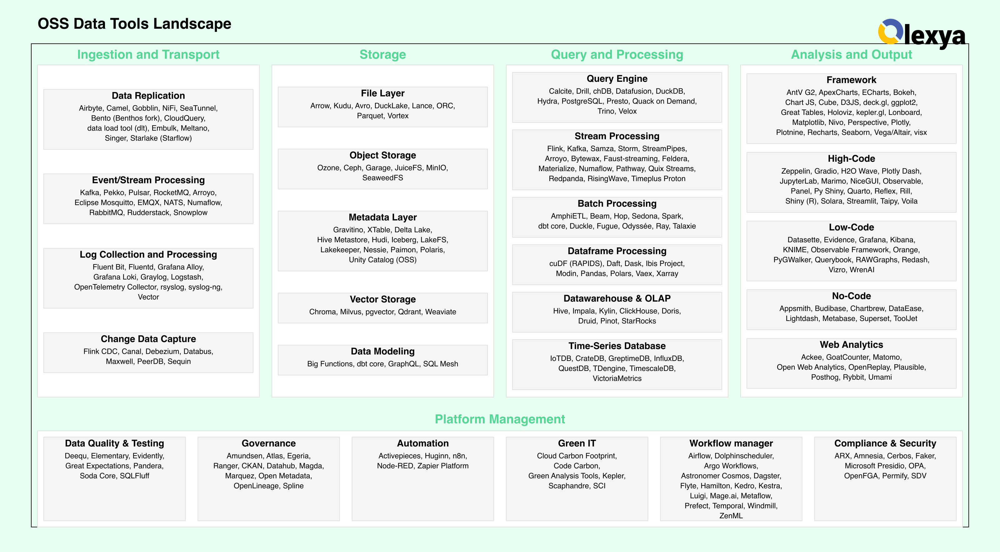

# OSS Data Tools Landscape

A landscape of **open-source** solutions for building a **composable data platform**:
an inventory by function, a classification by data flow, licenses, and an interactive report.

> **[Open the interactive report](docs/)** — search, filters (category, section, license,
> criteria) and sorting (stars, dates), with top/flop and recent/stale cues. Hosted on
> GitHub Pages, and also works when opened directly.

## Navigation

**Catalogues** — open-source tools inventoried by function:

- [Ingestion & Transport](01.ingestion_and_transport.md) — replication, event/stream, log collection, change data capture (CDC)
- [Storage](02.storage.md) — file formats, object storage, table/metadata layers, vector stores
- [Query & Processing](03.query_and_processing.md) — query engines, stream & batch, dataframes, OLAP, time-series
- [Analysis & Output](04.analysis_and_output.md) — viz frameworks, BI, dashboards, web analytics
- [Platform Management](05.platform_management.md) — orchestration, data quality, governance, automation, green IT

**Cross-cutting analyses** — the same tools, seen differently:

- [Classification by data flow](06.classification_par_flux.md) — streaming / micro-batching / batching
- [Flow × Function matrix](07.matrice_flux_fonction.md) — each tool mapped to its function and flow
- [Visualisations](08.visualisations_classification.md) — diagrams (heatmaps, pipelines, decision trees)

**Resources**:

- [Interactive report](docs/) — search, filter and sort every tool (table view, top/flop, recent/stale)
- [Licenses](09.licenses.md) — license families, limits and possibilities
- [Profile guides](company/) — recommended stacks by company size

## Project goals

- Identify the open-source solutions available on the market to build a composable data
  platform (note: this list may not be exhaustive, given the sheer number of solutions).
- Demonstrate how they work through a simple example implementation:
  [github.com/olexya/data-games-viz](https://github.com/olexya/data-games-viz).

## Market study

### Navigating the open-source data landscape

In today's data-driven world, a myriad of open-source solutions are available to process,
analyze and manage data. This abundance offers flexibility and power, but can also be
overwhelming for organizations trying to pick the right tools for their needs.

### The challenge of choice

The open-source community has developed numerous solutions covering the whole data chain
(ingestion, storage, query & processing, analysis, platform management).

While this diversity is a testament to the field's innovation, it makes decision-making
complex and time-consuming for teams building or evolving their data infrastructure.

### Our approach: tailored filters for informed decisions

To help with the choice, we propose a set of filters that take into account factors such as:

1. Company size and scale of data operations
2. Industry-specific requirements and regulations
3. Existing technology stack and integration needs
4. Performance and scalability needs
5. Level of in-house expertise and resources
6. Long-term maintainability and community support

By applying these filters, the vast catalogue is narrowed down to a manageable selection
of high-value tools for each use case.

### Benefits

- **Time-saving**: less time spent researching and evaluating unsuitable options.
- **Tailored recommendations**: aligned with the context and goals.
- **Risk mitigation**: avoid tools that scale or integrate poorly.
- **Informed decisions**: a structured approach to comparison and selection.

## A working prototype

An application to explore [Steam](https://store.steampowered.com) statistics.

It uses [Kestra](https://kestra.io), [dbt](https://www.getdbt.com),
[Evidence](https://evidence.dev) and [PostgreSQL](https://www.postgresql.org).

Get the project: [github.com/olexya/data-games-viz](https://github.com/olexya/data-games-viz)
