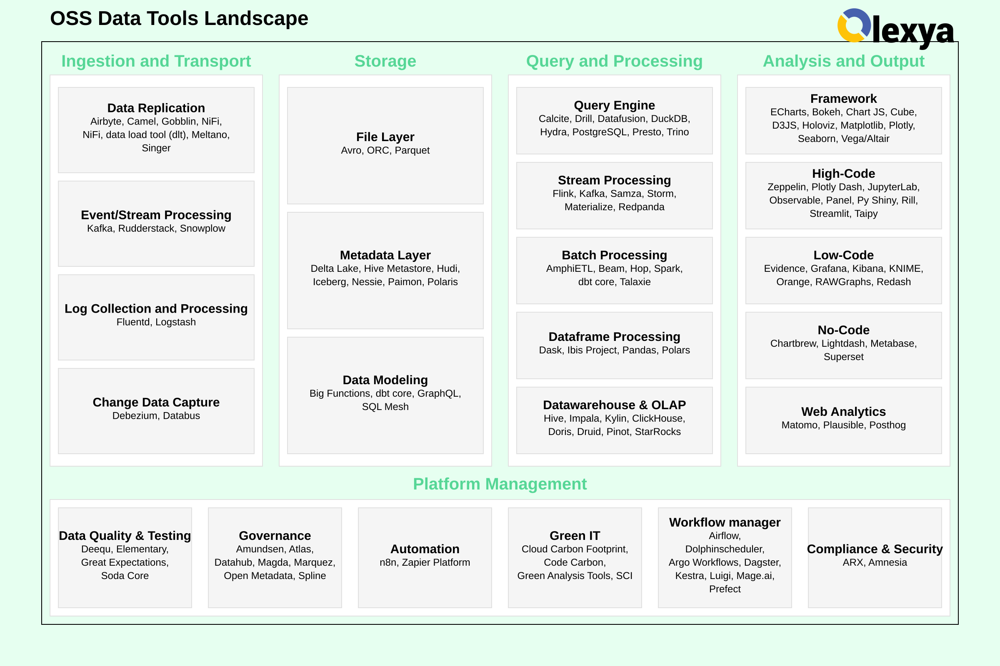

# OSS Data Tools Landscape

Welcome to the Composable Data Platform project repository. This project was developed with the primary objectives of:
- Identifying open source solutions available in the market for building a composable data platform (note: this list may not be exhaustive due to the vast number of solutions).
- Demonstrating the functionality of these solutions through a simple example implementation (https://github.com/olexya/data-games-viz)

## Market Study

### Navigating the Open-Source Data Landscape
In today's data-driven world, a myriad of open-source solutions are available for processing, analyzing, and managing data. This abundance of options, while providing great flexibility and power, can also be overwhelming for businesses trying to select the right tools for their specific needs.

### The Challenge of Choice
The open-source community has developed numerous solutions for various aspects of data handling, including:
- [Ingestion and Transport](01.ingestion_and_transport.md)
- [Storage](02.storage.md)
- [Query and Processing](03.query_and_processing.md)
- [Analysis and Output](04.analysis_and_output.md)
- [Platform Management](05.platform_management.md)

While this diversity is a testament to the innovation in the field, it can make the decision-making process complex and time-consuming for organizations looking to build or enhance their data infrastructure.

### Our Approach: Tailored Filters for Informed Decisions
Recognizing this challenge, we have developed a set of filters to help businesses identify the most suitable open-source solutions for their unique requirements. These filters take into account various factors such as:
1. Company size and scale of data operations
2. Specific industry requirements and regulations
3. Existing technology stack and integration needs
4. Performance requirements and scalability needs
5. Level of in-house expertise and resources
6. Long-term maintainability and community support

By applying these filters, companies can narrow down the vast array of options to a more manageable selection of tools that are likely to provide the most value for their specific use cases.

### Benefits of Our Filtering Approach

- Time-saving: Reduces the time spent on researching and evaluating unsuitable options
- Tailored recommendations: Provides suggestions that align with the company's specific context and goals
- Risk mitigation: Helps avoid selecting tools that may not scale or integrate well with existing systems
- Informed decision-making: Offers a structured approach to comparing and selecting solutions

Our goal is to simplify the process of navigating the rich landscape of open-source data solutions, enabling businesses to make informed decisions and leverage the power of open-source technologies effectively in their data strategies.

## A working prototype
An application to understand statistique of [Steam](https://store.steampowered.com)

The application using [Kestra](https://kestra.io), [dbt](https://www.getdbt.com), [Evidence](https://evidence.dev) and [PostgreSQL](postgresql.org/)

To get the project : https://github.com/olexya/data-games-viz