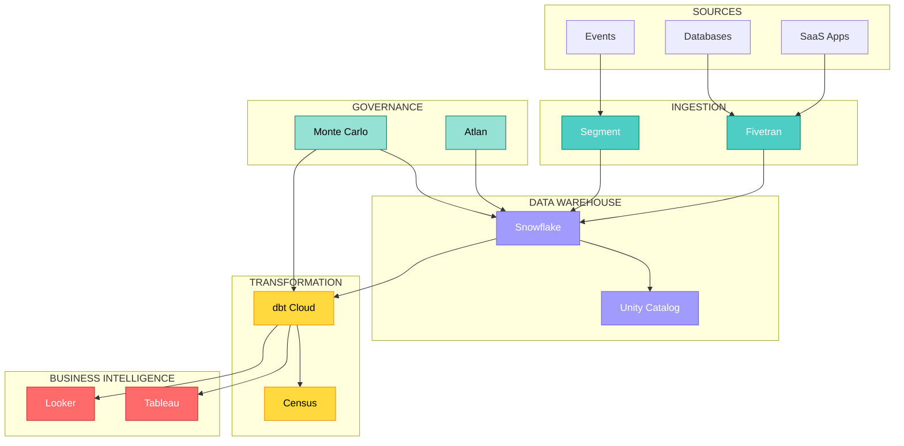
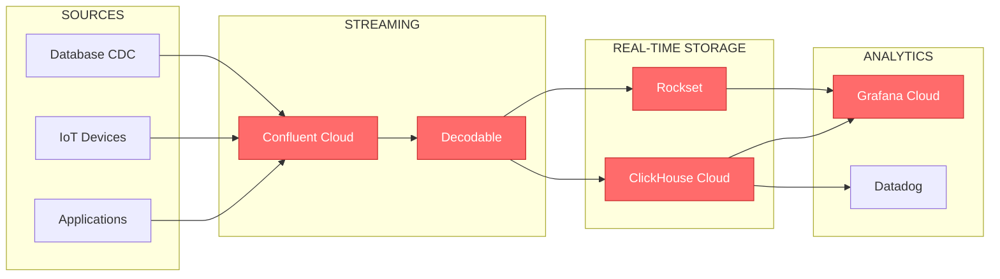
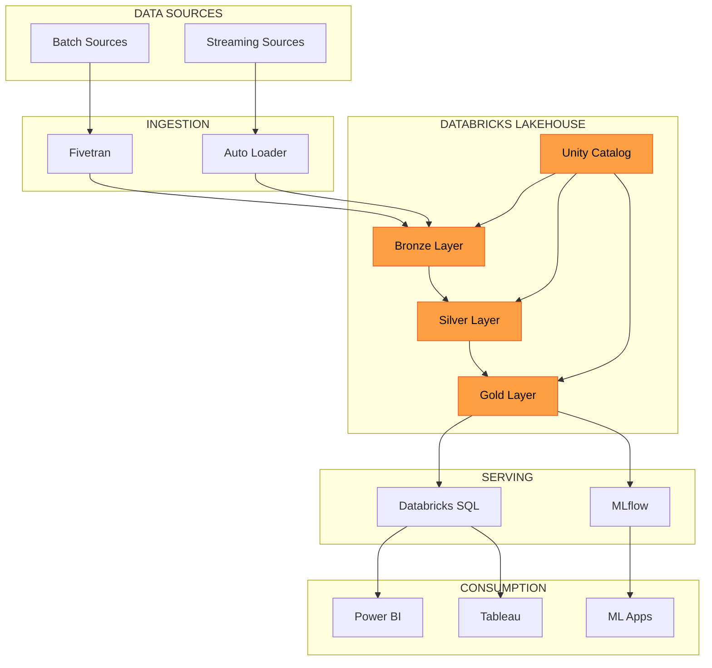
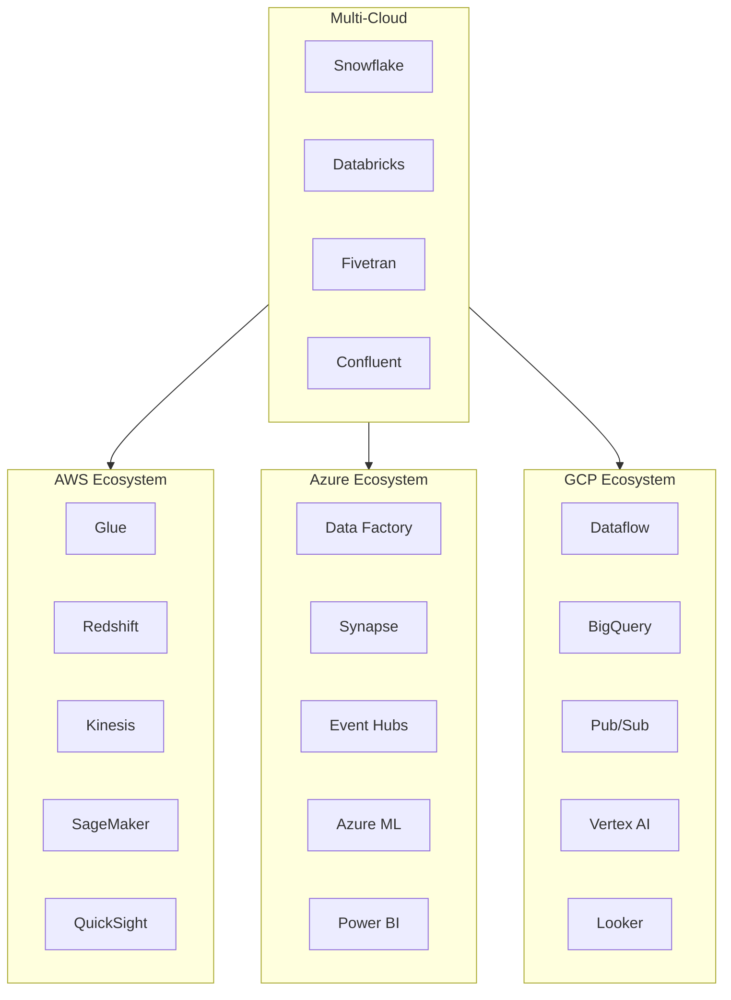

# Visualisations - Classification Solutions Commerciales

> **Objectif:** Visualisations pour la classification des solutions commerciales.

---

## 📊 Table des Matières

1. [Heatmap Globale Flux × Fonction](#1-heatmap-globale)
2. [Diagrammes de Pipeline Commercial](#2-diagrammes-de-pipeline)
3. [Comparaison Open Source vs Commercial](#3-comparaison)
4. [Pricing Landscape](#4-pricing-landscape)
5. [Vendor Ecosystem](#5-vendor-ecosystem)

---

## 1. Heatmap Globale

### Densité des Solutions Commerciales par Flux × Fonction

```
HEATMAP: Solutions Commerciales Disponibles
═══════════════════════════════════════════════════════════════

              │ Collecte │Transport│ Stockage│Traitement│ Analyse │Gouvernance│
──────────────┼──────────┼─────────┼─────────┼──────────┼─────────┼───────────┤
🌊 Streaming  │   ████   │  ████   │   ███   │   ███    │   ████  │    ██     │
              │   15+    │   12+   │   8+    │   10+    │   12+   │    5+     │
──────────────┼──────────┼─────────┼─────────┼──────────┼─────────┼───────────┤
⚡Micro-Batch │   ████   │  ████   │  ████   │   ████   │  █████  │    ███    │
              │   20+    │   15+   │   15+   │   18+    │   25+   │   10+     │
──────────────┼──────────┼─────────┼─────────┼──────────┼─────────┼───────────┤
📦 Batching   │   ████   │   ███   │  █████  │   ████   │  █████  │   ████    │
              │   20+    │   10+   │   18+   │   20+    │   30+   │   15+     │
──────────────┴──────────┴─────────┴─────────┴──────────┴─────────┴───────────┘

Insights:
- Analyse & Batching = zone la plus dense (30+ outils BI)
- Streaming Gouvernance = zone moins mature
- Micro-Batching = couverture équilibrée
```

---

## 2. Diagrammes de Pipeline Commercial

### Modern Data Stack - Enterprise



### Real-time Analytics Stack



### Databricks Lakehouse



---

## 3. Comparaison Open Source vs Commercial

### Radar - Critères de Choix

```
                    Facilité de Mise en Place
                              5
                              │
                              │
        Support Enterprise    │      Coût Total
                    4 ────────┼──────── 2
                              │
                              │
         Flexibilité 3 ───────┼─────── 3 Scalabilité
                              │
                              │
                    2 ────────┼──────── 4
               Communauté     │      Sécurité Intégrée
                              │
                              1

─── Open Source (moyenne)
═══ Commercial (moyenne)
```

### Tableau Comparatif

```
╔═══════════════════╤════════════════╤════════════════╗
║     Critère       │  Open Source   │   Commercial   ║
╠═══════════════════╪════════════════╪════════════════╣
║ Coût Initial      │     ★★★★★      │      ★★☆☆☆     ║
║ Coût à Scale      │     ★★★☆☆      │      ★★★☆☆     ║
║ Time to Value     │     ★★☆☆☆      │      ★★★★★     ║
║ Maintenance       │     ★★☆☆☆      │      ★★★★★     ║
║ Customisation     │     ★★★★★      │      ★★★☆☆     ║
║ Support           │     ★★☆☆☆      │      ★★★★★     ║
║ Sécurité/Compliance│    ★★★☆☆      │      ★★★★★     ║
║ Vendor Lock-in    │     ★★★★★      │      ★★☆☆☆     ║
╚═══════════════════╧════════════════╧════════════════╝

★ = Score (5 = meilleur)
```

---

## 4. Pricing Landscape

### Modèles de Pricing par Catégorie

```
MODÈLES DE PRICING - SOLUTIONS COMMERCIALES
════════════════════════════════════════════

┌─────────────────────────────────────────────────────────────┐
│                    USAGE-BASED                               │
│  ┌──────────┐  ┌──────────┐  ┌──────────┐  ┌──────────┐    │
│  │ Snowflake│  │ BigQuery │  │Confluent │  │ Datadog  │    │
│  │ Credits  │  │ Per Query│  │ Per GB   │  │ Per Host │    │
│  └──────────┘  └──────────┘  └──────────┘  └──────────┘    │
├─────────────────────────────────────────────────────────────┤
│                    SEAT-BASED                                │
│  ┌──────────┐  ┌──────────┐  ┌──────────┐  ┌──────────┐    │
│  │ Tableau  │  │  Looker  │  │   Hex    │  │  Alation │    │
│  │ Per User │  │ Per User │  │ Per Seat │  │ Per User │    │
│  └──────────┘  └──────────┘  └──────────┘  └──────────┘    │
├─────────────────────────────────────────────────────────────┤
│                    HYBRID                                    │
│  ┌──────────┐  ┌──────────┐  ┌──────────┐  ┌──────────┐    │
│  │ Fivetran │  │Monte Carlo│ │dbt Cloud │  │Astronomer│    │
│  │MAR+Volume│  │ Tables   │  │Seats+Runs│  │Env+Runs  │    │
│  └──────────┘  └──────────┘  └──────────┘  └──────────┘    │
└─────────────────────────────────────────────────────────────┘
```

### Estimation Budget Annuel par Taille

```
BUDGET ESTIMATIF ANNUEL (Stack Modern Data)
═══════════════════════════════════════════

Startup (< 50 employés, < 100GB/jour)
┌─────────────────────────────────────────┐
│ Fivetran Starter     │    $5,000       │
│ Snowflake            │   $15,000       │
│ dbt Cloud            │    $5,000       │
│ Metabase/Preset      │    $3,000       │
├─────────────────────────────────────────┤
│ TOTAL                │  ~$30,000/an    │
└─────────────────────────────────────────┘

Scale-up (50-200 employés, 100GB-1TB/jour)
┌─────────────────────────────────────────┐
│ Fivetran             │   $40,000       │
│ Snowflake            │   $80,000       │
│ dbt Cloud            │   $20,000       │
│ Looker/Tableau       │   $50,000       │
│ Monte Carlo          │   $30,000       │
├─────────────────────────────────────────┤
│ TOTAL                │ ~$220,000/an    │
└─────────────────────────────────────────┘

Enterprise (200+ employés, > 1TB/jour)
┌─────────────────────────────────────────┐
│ Fivetran Enterprise  │  $150,000       │
│ Snowflake/Databricks │  $500,000+      │
│ dbt Cloud Enterprise │   $50,000       │
│ Tableau/Looker       │  $200,000       │
│ Collibra/Alation     │  $150,000       │
│ Monte Carlo          │  $100,000       │
├─────────────────────────────────────────┤
│ TOTAL                │ ~$1,200,000/an  │
└─────────────────────────────────────────┘
```

---

## 5. Vendor Ecosystem

### Carte des Acquisitions Majeures (2019-2024)

```
ACQUISITIONS DATA ECOSYSTEM
═══════════════════════════════════════════

Salesforce ─────────► Tableau (2019, $15.7B)
                   └─► MuleSoft, Slack

Google ─────────────► Looker (2020, $2.6B)
                   └─► Dataform (2020)

Databricks ─────────► MosaicML (2023, $1.3B)
                   └─► Okera (2023)

Qlik ───────────────► Talend (2023, $1.0B)
                   └─► Attunity, Blendr.io

Fivetran ───────────► HVR (2021, $700M)

Snowflake ──────────► Streamlit (2022, $800M)
                   └─► Neeva (2023)

Cisco ──────────────► Splunk (2023, $28B)
```

### Écosystème par Cloud Provider



---

## 6. Arbres de Décision

### Arbre 1 : Choix Data Warehouse

```
                    Quel est votre cloud principal?
                              │
         ┌────────────────────┼────────────────────┐
         │                    │                    │
        AWS                 Azure                 GCP
         │                    │                    │
    Multi-cloud?         Multi-cloud?        Multi-cloud?
         │                    │                    │
    ┌────┴────┐          ┌────┴────┐         ┌────┴────┐
   Oui       Non        Oui       Non       Oui       Non
    │         │          │         │          │         │
Snowflake  Redshift  Snowflake  Synapse  Snowflake  BigQuery
Databricks            Databricks           Databricks

Besoin ML avancé? ───► Databricks
Besoin BI intégré? ──► Snowflake (Streamlit) ou BigQuery (Looker)
Budget contraint? ───► BigQuery (serverless) ou Redshift Serverless
```

### Arbre 2 : Choix ETL/ELT

```
                    Volume quotidien de données?
                              │
              ┌───────────────┼───────────────┐
              │               │               │
          < 10 GB        10-500 GB        > 500 GB
              │               │               │
         Budget?         Latence?        Enterprise?
              │               │               │
         ┌────┴────┐    ┌────┴────┐    ┌────┴────┐
        Low      High  < 1h     > 1h   Oui      Non
         │        │     │        │      │        │
       Stitch  Fivetran Fivetran Airbyte Informatica Fivetran
       Hevo            (Standard)(OSS)   Matillion
```

---

## 7. Timeline Évolution Marché

```
ÉVOLUTION DU MARCHÉ COMMERCIAL (2015-2025)
═══════════════════════════════════════════

2015 ──── AWS Redshift dominant
     │    Tableau leader BI
     │
2017 ──── Snowflake en croissance
     │    Looker monte en puissance
     │
2019 ──── Fivetran devient standard ELT
     │    Databricks Lakehouse
     │    Acquisitions: Tableau, Looker
     │
2021 ──── Data Observability émerge
     │    Monte Carlo, Bigeye
     │    Reverse ETL: Census, Hightouch
     │
2023 ──── AI/LLM intégration
     │    Consolidation marché
     │    Snowflake Cortex, Databricks AI
     │
2025 ──── Semantic Layer wars
     │    Data Mesh tools
     │    AI-native platforms
```

---

## 8. Recommandations par Profil

### Matrice de Sélection

```
╔═══════════════════╤═══════════════════════════════════════════╗
║   Profil          │        Stack Recommandée                   ║
╠═══════════════════╪═══════════════════════════════════════════╣
║ Startup           │ Fivetran → Snowflake → dbt → Preset       ║
║ (< $50K budget)   │ ou: Airbyte → BigQuery → dbt → Metabase   ║
╟───────────────────┼───────────────────────────────────────────╢
║ Scale-up          │ Fivetran → Snowflake → dbt Cloud → Looker ║
║ ($50-200K budget) │ + Monte Carlo + Atlan                     ║
╟───────────────────┼───────────────────────────────────────────╢
║ Enterprise        │ Informatica → Databricks → dbt Enterprise ║
║ (> $500K budget)  │ + Tableau + Collibra + Monte Carlo        ║
╟───────────────────┼───────────────────────────────────────────╢
║ Real-time Heavy   │ Confluent → Decodable → ClickHouse Cloud  ║
║                   │ → Grafana Cloud                            ║
╟───────────────────┼───────────────────────────────────────────╢
║ ML/AI Focus       │ Databricks Lakehouse + MLflow + Weights&B ║
║                   │ + Feature Store (Tecton)                   ║
╚═══════════════════╧═══════════════════════════════════════════╝
```

---

## 🔗 Références

- [Visualisations Open Source](../08.visualisations_classification.md)
- [Classification par Flux - Commercial](06.classification_par_flux.md)
- [Matrice Flux × Fonction - Commercial](07.matrice_flux_fonction.md)

---

**Document créé le:** 2025-12-15
**Dernière mise à jour:** 2025-12-15
**Version:** 1.0

