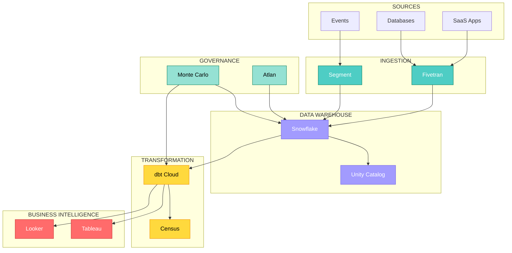
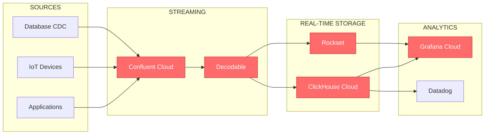
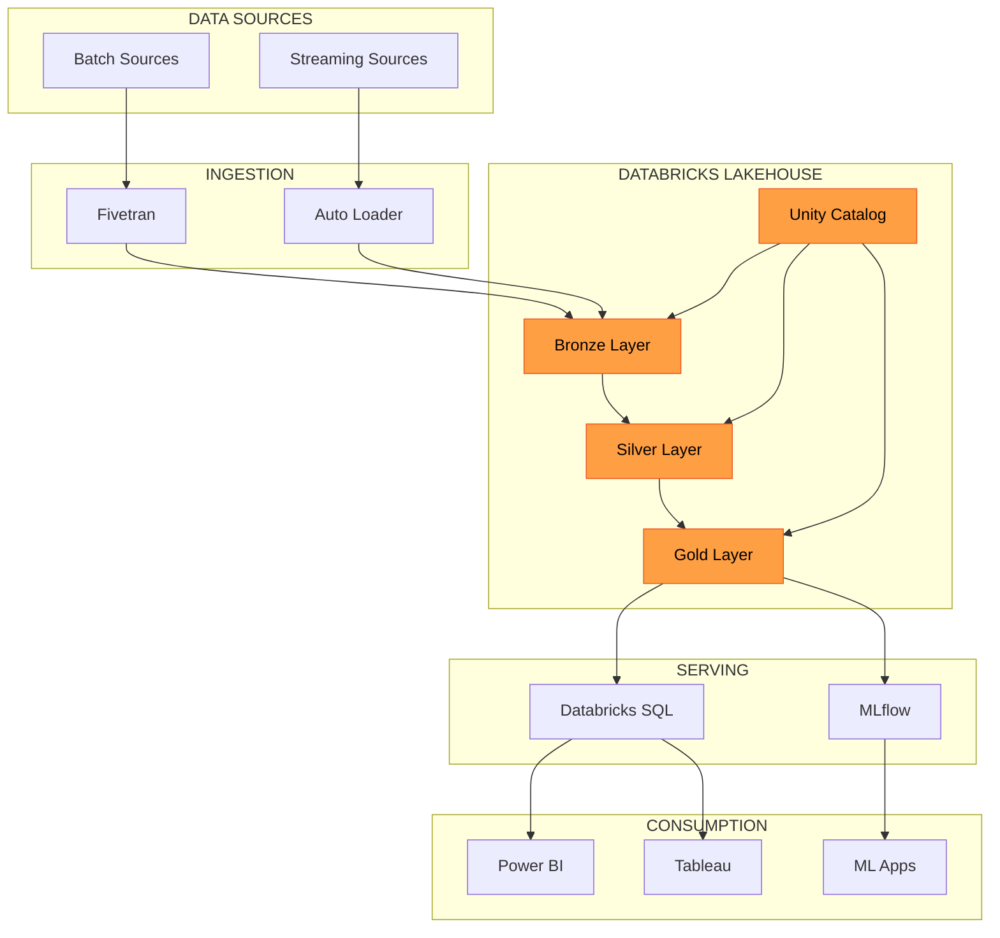
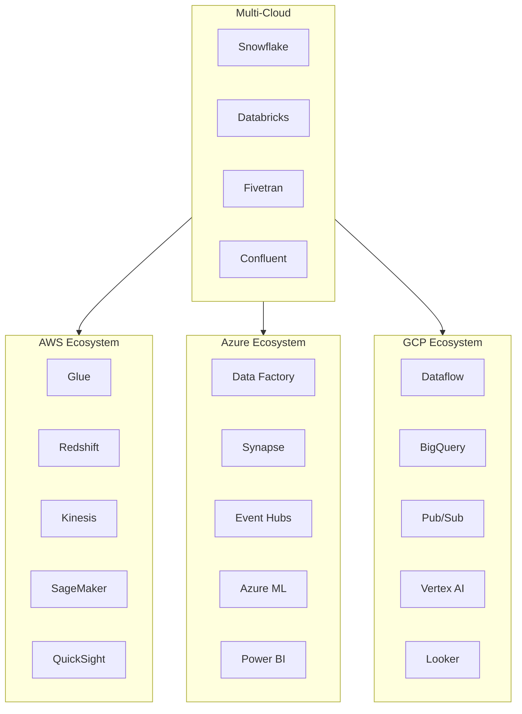
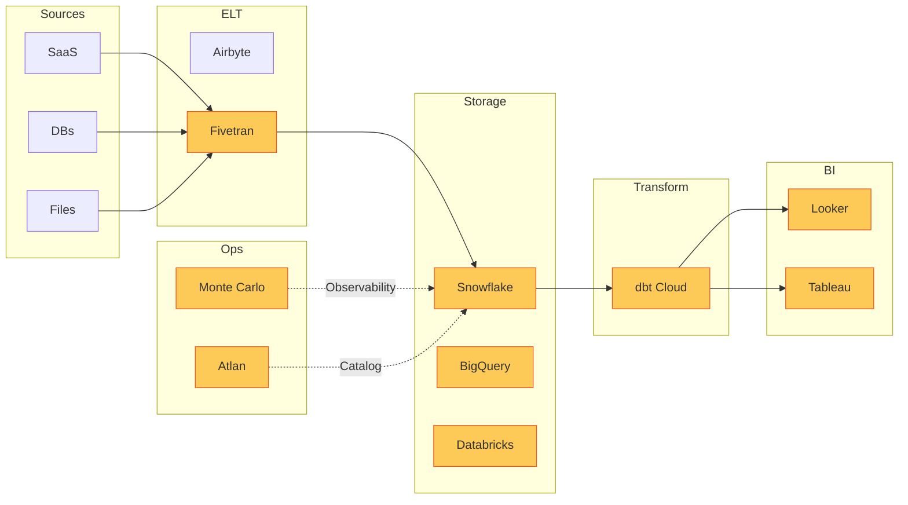

# Visualisations - Classification Solutions Commerciales

> **Objectif:** Proposer des visualisations interactives et diagrammes pour faciliter la compréhension de la classification bidimensionnelle des solutions commerciales.

---

## Table des Matières

1. [Heatmap Globale Flux × Fonction](#1-heatmap-globale)
2. [Diagrammes de Pipeline par Stack](#2-diagrammes-de-pipeline)
3. [Graphiques en Radar - Versatilité](#3-graphiques-radar)
4. [Sankey Diagrams - Flow de Données](#4-sankey-diagrams)
5. [Timeline - Évolution Temporelle](#5-timeline)
6. [Arbres de Décision Interactifs](#6-arbres-de-décision)
7. [Network Graphs - Écosystèmes](#7-network-graphs)
8. [Dashboards Recommandés](#8-dashboards-interactifs)

---

## 1. Heatmap Globale Flux × Fonction

### ASCII Heatmap avec Intensité

```
HEATMAP: Densité d'Outils Commerciaux (Flux × Fonction)
═══════════════════════════════════════════════════════════════

              │ Collecte │Transport│ Stockage│Traitement│ Analyse │Gouvernance│
──────────────┼──────────┼─────────┼─────────┼──────────┼─────────┼───────────┤
 Streaming  │   ████   │  ████   │   ███   │   ███    │   ████  │    ██     │
              │   15+    │   12+   │   8+    │   10+    │   12+   │    5+     │
──────────────┼──────────┼─────────┼─────────┼──────────┼─────────┼───────────┤
Micro-Batch │   ████   │  ████   │  ████   │   ████   │  █████  │    ███    │
              │   20+    │   15+   │   15+   │   18+    │   25+   │   10+     │
──────────────┼──────────┼─────────┼─────────┼──────────┼─────────┼───────────┤
 Batching   │   ████   │   ███   │  █████  │   ████   │  █████  │   ████    │
              │   20+    │   10+   │   18+   │   20+    │   30+   │   15+     │
──────────────┴──────────┴─────────┴─────────┴──────────┴─────────┴───────────┘

Légende Intensité: ▓ (1-5) █ (5-10) ██ (10-15) ███ (15-20) ████ (20+)

Insights:
- Analyse & Batching = zone la plus dense (30+ outils BI)
- Streaming Gouvernance = zone moins mature
- Micro-Batching = couverture équilibrée
```

---

## 2. Diagrammes de Pipeline par Stack

### Modern Data Stack - Enterprise


```mermaid
flowchart TB
    subgraph Sources["SOURCES"]
        S1["SaaS Apps"]
        S2["Databases"]
        S3["Events"]
    end

    subgraph Ingestion["INGESTION"]
        FT["Fivetran"]
        SEG["Segment"]
    end

    subgraph Storage["DATA WAREHOUSE"]
        SNOW["Snowflake"]
        UNITY["Unity Catalog"]
    end

    subgraph Transform["TRANSFORMATION"]
        DBT["dbt Cloud"]
        CENSUS["Census"]
    end

    subgraph BI["BUSINESS INTELLIGENCE"]
        LOOK["Looker"]
        TAB["Tableau"]
    end

    subgraph Governance["GOVERNANCE"]
        ATL["Atlan"]
        MC["Monte Carlo"]
    end

    S1 --> FT
    S2 --> FT
    S3 --> SEG
    FT --> SNOW
    SEG --> SNOW
    SNOW --> DBT
    SNOW --> UNITY
    DBT --> LOOK
    DBT --> TAB
    DBT --> CENSUS
    ATL --> SNOW
    MC --> SNOW
    MC --> DBT

    classDef ingestion fill:#4ecdc4,stroke:#087f5b,color:#fff
    classDef storage fill:#a29bfe,stroke:#6c5ce7,color:#fff
    classDef transform fill:#ffd93d,stroke:#f08c00,color:#000
    classDef bi fill:#ff6b6b,stroke:#c92a2a,color:#fff
    classDef gov fill:#95e1d3,stroke:#087f5b,color:#000

    class FT,SEG ingestion
    class SNOW,UNITY storage
    class DBT,CENSUS transform
    class LOOK,TAB bi
    class ATL,MC gov
```

### Real-time Analytics Stack


```mermaid
flowchart LR
    subgraph Sources["SOURCES"]
        APP["Applications"]
        IOT["IoT Devices"]
        CDC["Database CDC"]
    end

    subgraph Streaming["STREAMING"]
        CONF["Confluent Cloud"]
        DEC["Decodable"]
    end

    subgraph Storage["REAL-TIME STORAGE"]
        CH["ClickHouse Cloud"]
        ROCK["Rockset"]
    end

    subgraph Analytics["ANALYTICS"]
        GRAF["Grafana Cloud"]
        DD["Datadog"]
    end

    APP --> CONF
    IOT --> CONF
    CDC --> CONF
    CONF --> DEC
    DEC --> CH
    DEC --> ROCK
    CH --> GRAF
    ROCK --> GRAF
    CH --> DD

    classDef streaming fill:#ff6b6b,stroke:#c92a2a,color:#fff
    class CONF,DEC,CH,ROCK,GRAF streaming
```

### Databricks Lakehouse


```mermaid
flowchart TD
    subgraph Sources["DATA SOURCES"]
        BATCH["Batch Sources"]
        STREAM["Streaming Sources"]
    end

    subgraph Ingest["INGESTION"]
        FT["Fivetran"]
        AUTOLOAD["Auto Loader"]
    end

    subgraph Lakehouse["DATABRICKS LAKEHOUSE"]
        BRONZE["Bronze Layer"]
        SILVER["Silver Layer"]
        GOLD["Gold Layer"]
        UNITY["Unity Catalog"]
    end

    subgraph Serve["SERVING"]
        SQL["Databricks SQL"]
        ML["MLflow"]
    end

    subgraph Consume["CONSUMPTION"]
        PBI["Power BI"]
        TAB["Tableau"]
        APP["ML Apps"]
    end

    BATCH --> FT
    STREAM --> AUTOLOAD
    FT --> BRONZE
    AUTOLOAD --> BRONZE
    BRONZE --> SILVER
    SILVER --> GOLD
    UNITY --> BRONZE
    UNITY --> SILVER
    UNITY --> GOLD
    GOLD --> SQL
    GOLD --> ML
    SQL --> PBI
    SQL --> TAB
    ML --> APP

    classDef lake fill:#ff9f43,stroke:#ee5a24,color:#000
    class BRONZE,SILVER,GOLD,UNITY lake
```

---

## 3. Graphiques Radar - Versatilité des Outils

### Radar 1: Databricks (Multi-Mode)

```
        Collecte (1/3)
               |
               |
Gouvernance    |      Transport (0/3)
    (2/3)      |     /
         \     |   /
           \   | /
             \ |/
    ──────────●──────────
             /|\
           /  |  \
         /    |    \
    (3/3)     |      (3/3)
 Analyse      |      Stockage
              |
              |
        Traitement (3/3)

Score Total: 12/18 = 67%
Spécialité: Lakehouse (Stockage + Traitement + Gouvernance)
```

### Radar 2: Snowflake (Data Warehouse)

```
        Collecte (0/3)
               |
               |
Gouvernance    |      Transport (0/3)
    (3/3)      |     /
         \     |   /
           \   | /
             \ |/
    ──────────●──────────
             /|\
           /  |  \
         /    |    \
    (3/3)     |      (3/3)
 Analyse      |      Stockage
              |
              |
        Traitement (2/3)

Score Total: 11/18 = 61%
Spécialité: Analytics (Stockage + Analyse + Gouvernance)
```

### Comparaison Top 5 Outils (Format Tableau)

```
═══════════════════════════════════════════════════════════════════════════
                    VERSATILITÉ DES OUTILS COMMERCIAUX (Score sur 18)
═══════════════════════════════════════════════════════════════════════════
Outil           │Collecte│Transport│Stockage│Traitement│Analyse│Gouvernance│Total
────────────────┼────────┼─────────┼────────┼──────────┼───────┼───────────┼─────
Databricks      │  █     │    ▓    │  ███   │   ███    │  ███  │    ██     │ 12
Snowflake       │  ▓     │    ▓    │  ███   │    ██    │  ███  │   ███     │ 11
BigQuery        │  ▓     │    ▓    │  ███   │   ███    │  ███  │    ██     │ 11
Confluent Cloud │  █     │   ███   │   █    │   ███    │   ▓   │     ▓     │ 10
Datadog         │  ███   │    ▓    │   ▓    │    ▓     │  ███  │    ██     │ 10
────────────────┴────────┴─────────┴────────┴──────────┴───────┴───────────┴─────

Légende: ▓ (0.5) █ (1) ██ (2) ███ (3)
```

---

## 4. Sankey Diagrams - Flow de Données

### Sankey: Journey d'un Event dans Lambda Architecture Commercial

```
Event Source
     │
     ├──────────────────────────────────────┐
     │                                      │
     ▼                                      ▼
[Speed Path - Streaming]           [Batch Path - Batching]
     │                                      │
     ├─→ Striim (Collecte)                  ├─→ Fivetran (Collecte)
     │       ↓                              │       ↓
     ├─→ Confluent (Transport)              │   (pas de transport)
     │       ↓                              │       ↓
     ├─→ Decodable (Traitement)             ├─→ dbt Cloud (Traitement)
     │       ↓                              │       ↓
     ├─→ ClickHouse Cloud (Stockage)        ├─→ Snowflake (Stockage)
     │       ↓                              │       ↓
     │       └────────────┐                 │       │
     │                    │                 │       │
     │                    ▼                 │       │
     │              ┌──────────┐            │       │
     └──────────────┤ Starburst│◄───────────┘       │
                    │ (Query)  │                    │
                    └────┬─────┘                    │
                         │                          │
                    ┌────┴─────┐                    │
                    ▼          ▼                    │
               Grafana    Looker◄───────────────────┘
            (Real-time)     (BI)

Latence:
- Speed Path: 100ms - 1s
- Batch Path: 1h - 24h
```

---

## 5. Timeline - Évolution Temporelle

### Timeline: Maturation par Flux Commercial (2010-2025)

```
2010 │
     │   BATCH ERA - ON-PREMISE
     │  ━━━━━━━━━━━━━━━━━━━━━━━━━━━━━━━━━━━━━━━━━━━━━━━━━━━━━
     │  Informatica, Talend, Oracle, IBM
     │
2014 │                     CLOUD DATA WAREHOUSES
     │                    ━━━━━━━━━━━━━━━━━━━━━━━━━━━━━━━━━━━
     │                    Redshift (2012), BigQuery (2012)
     │
2017 │                               MODERN DATA STACK EMERGENCE
     │                              ━━━━━━━━━━━━━━━━━━━━━━━━━━━━
     │                              Fivetran, Stitch, Looker
     │                              Snowflake growth
     │
2020 │                                         STREAMING MATURITY
     │                                        ━━━━━━━━━━━━━━━━━━
     │                                        Confluent Cloud
     │                                        Databricks Lakehouse
     │
2023 │                                                   AI ERA
     │   Batch: Dominant                              ▲
     │   Micro: Standard (MDS)
     │   Stream: Growing (Real-time analytics)

Tendance: AI integration + Unification Batch/Streaming
```

### Timeline: Acquisitions Majeures

```
ACQUISITIONS DATA ECOSYSTEM (2019-2024)
═══════════════════════════════════════════

Salesforce ─────────► Tableau (2019, $15.7B)
                   └─► MuleSoft, Slack

Google ─────────────► Looker (2020, $2.6B)
                   └─► Dataform (2020)

Databricks ─────────► MosaicML (2023, $1.3B)
                   └─► Okera (2023)

Qlik ───────────────► Talend (2023, $1.0B)
                   └─► Attunity, Blendr.io

Fivetran ───────────► HVR (2021, $700M)

Snowflake ──────────► Streamlit (2022, $800M)
                   └─► Neeva (2023)

Cisco ──────────────► Splunk (2023, $28B)
```

---

## 6. Arbres de Décision Interactifs

### Arbre 1: Choix Data Warehouse Commercial

```
                    Quel est votre cloud principal?
                              │
         ┌────────────────────┼────────────────────┐
         │                    │                    │
        AWS                 Azure                 GCP
         │                    │                    │
    Multi-cloud?         Multi-cloud?        Multi-cloud?
         │                    │                    │
    ┌────┴────┐          ┌────┴────┐         ┌────┴────┐
   Oui       Non        Oui       Non       Oui       Non
    │         │          │         │          │         │
Snowflake  Redshift  Snowflake  Synapse  Snowflake  BigQuery
Databricks            Databricks           Databricks

Besoin ML avancé? ───► Databricks
Besoin BI intégré? ──► Snowflake (Streamlit) ou BigQuery (Looker)
Budget contraint? ───► BigQuery (serverless) ou Redshift Serverless
```

### Arbre 2: Choix ETL/ELT Commercial

```
                    Volume quotidien de données?
                              │
              ┌───────────────┼───────────────┐
              │               │               │
          < 10 GB        10-500 GB        > 500 GB
              │               │               │
         Budget?         Latence?        Enterprise?
              │               │               │
         ┌────┴────┐    ┌────┴────┐    ┌────┴────┐
        Low      High  < 1h     > 1h   Oui      Non
         │        │     │        │      │        │
       Stitch  Fivetran Fivetran Airbyte Informatica Fivetran
       Hevo            (Standard) (OSS)   Matillion
```

---

## 7. Network Graphs - Écosystèmes

### Graph 1: Écosystème par Cloud Provider


```mermaid
graph TB
    subgraph AWS["AWS Ecosystem"]
        GLUE["Glue"]
        RS["Redshift"]
        KIN["Kinesis"]
        SAGE["SageMaker"]
        QS["QuickSight"]
    end

    subgraph Azure["Azure Ecosystem"]
        ADF["Data Factory"]
        SYN["Synapse"]
        EH["Event Hubs"]
        AML["Azure ML"]
        PBI["Power BI"]
    end

    subgraph GCP["GCP Ecosystem"]
        DF["Dataflow"]
        BQ["BigQuery"]
        PS["Pub/Sub"]
        VAI["Vertex AI"]
        LOOK["Looker"]
    end

    subgraph Multi["Multi-Cloud"]
        SNOW["Snowflake"]
        DBR["Databricks"]
        FT["Fivetran"]
        CONF["Confluent"]
    end

    Multi --> AWS
    Multi --> Azure
    Multi --> GCP
```

### Graph 2: Modern Data Stack Ecosystem


```mermaid
graph LR
    subgraph Sources
        S1[SaaS]
        S2[DBs]
        S3[Files]
    end

    subgraph ELT
        AIRBYTE[Airbyte]
        FIVETRAN[Fivetran]
    end

    subgraph Storage
        SNOW[Snowflake]
        BQ[BigQuery]
        DBR[Databricks]
    end

    subgraph Transform
        DBT[dbt Cloud]
    end

    subgraph BI
        LOOK[Looker]
        TAB[Tableau]
    end

    subgraph Ops
        MC[Monte Carlo]
        ATLAN[Atlan]
    end

    S1 & S2 & S3 --> FIVETRAN
    FIVETRAN --> SNOW
    SNOW --> DBT
    DBT --> LOOK
    DBT --> TAB

    MC -.->|Observability| SNOW
    ATLAN -.->|Catalog| SNOW

    classDef commercial fill:#feca57,stroke:#ee5a24
    class FIVETRAN,SNOW,BQ,DBR,DBT,LOOK,TAB,MC,ATLAN commercial
```

---

## 8. Dashboards Interactifs Recommandés

### Dashboard 1: Vue Globale Commercial

```
┌─────────────────────────────────────────────────────────────────┐
│  COMMERCIAL DATA TOOLS LANDSCAPE - Vue d'Ensemble               │
├─────────────────────────────────────────────────────────────────┤
│                                                                 │
│  [Heatmap]              [Bar Chart]          [Pie Chart]        │
│  Flux × Fonction        Top 10 Vendors       Distribution Cloud │
│  ┌──────────────┐      ┌──────────────┐    ┌──────────────┐   │
│  │   15 12  8   │      │ Snowflake ██ │    │   AWS  35%   │   │
│  │   20 15  15  │      │ Databricks █ │    │   Azure 25%  │   │
│  │   20 10  18  │      │ Confluent ██ │    │   GCP  20%   │   │
│  └──────────────┘      └──────────────┘    │   Multi 20%  │   │
│                                             └──────────────┘   │
│                                                                 │
│  [Table - Leaders by Category]                                  │
│  ┌───────────────────────────────────────────────────────────┐│
│  │ Category    │ Leader #1      │ Leader #2    │ Leader #3   ││
│  ├─────────────┼────────────────┼──────────────┼─────────────┤│
│  │ ETL         │ Fivetran       │ Matillion    │ Informatica ││
│  │ Warehouse   │ Snowflake      │ Databricks   │ BigQuery    ││
│  │ BI          │ Tableau        │ Power BI     │ Looker      ││
│  │ Governance  │ Collibra       │ Alation      │ Atlan       ││
│  └───────────────────────────────────────────────────────────┘│
└─────────────────────────────────────────────────────────────────┘
```

### Dashboard 2: Pricing Landscape

```
BUDGET ESTIMATIF ANNUEL (Stack Modern Data Commercial)
═══════════════════════════════════════════════════════

Startup (< 50 employés, < 100GB/jour)
┌─────────────────────────────────────────┐
│ Fivetran Starter     │    $5,000       │
│ Snowflake            │   $15,000       │
│ dbt Cloud            │    $5,000       │
│ Preset               │    $3,000       │
├─────────────────────────────────────────┤
│ TOTAL                │  ~$30,000/an    │
└─────────────────────────────────────────┘

Scale-up (50-200 employés, 100GB-1TB/jour)
┌─────────────────────────────────────────┐
│ Fivetran             │   $40,000       │
│ Snowflake            │   $80,000       │
│ dbt Cloud            │   $20,000       │
│ Looker/Tableau       │   $50,000       │
│ Monte Carlo          │   $30,000       │
├─────────────────────────────────────────┤
│ TOTAL                │ ~$220,000/an    │
└─────────────────────────────────────────┘

Enterprise (200+ employés, > 1TB/jour)
┌─────────────────────────────────────────┐
│ Fivetran Enterprise  │  $150,000       │
│ Snowflake/Databricks │  $500,000+      │
│ dbt Cloud Enterprise │   $50,000       │
│ Tableau/Looker       │  $200,000       │
│ Collibra/Alation     │  $150,000       │
│ Monte Carlo          │  $100,000       │
├─────────────────────────────────────────┤
│ TOTAL                │ ~$1,200,000/an  │
└─────────────────────────────────────────┘
```

---

## 9. Graphiques Statistiques Supplémentaires

### Distribution des Outils par Fonction (Bar Chart)

```
Nombre d'Outils Commerciaux par Fonction
━━━━━━━━━━━━━━━━━━━━━━━━━━━

Analyse       ████████████████████████████  (45+)
Stockage      ██████████████████████        (35+)
Traitement    █████████████████████         (30+)
Collecte      ████████████████████          (28+)
Gouvernance   ███████████████               (20+)
Transport     ████████████                  (15+)

              0   10   20   30   40   50
```

### Comparaison Open Source vs Commercial

```
╔═══════════════════╤════════════════╤════════════════╗
║     Critère       │  Open Source   │   Commercial   ║
╠═══════════════════╪════════════════╪════════════════╣
║ Coût Initial      │           │           ║
║ Coût à Scale      │           │           ║
║ Time to Value     │           │           ║
║ Maintenance       │           │           ║
║ Customisation     │           │           ║
║ Support           │           │           ║
║ Sécurité/Compliance│          │           ║
║ Vendor Lock-in    │           │           ║
╚═══════════════════╧════════════════╧════════════════╝

 = Score (5 = meilleur)
```

---

## 10. Recommandations par Profil

### Matrice de Sélection

```
╔═══════════════════╤═══════════════════════════════════════════╗
║   Profil          │        Stack Recommandée                   ║
╠═══════════════════╪═══════════════════════════════════════════╣
║ Startup           │ Fivetran → Snowflake → dbt → Preset       ║
║ (< $50K budget)   │ ou: Airbyte → BigQuery → dbt → Metabase   ║
╟───────────────────┼───────────────────────────────────────────╢
║ Scale-up          │ Fivetran → Snowflake → dbt Cloud → Looker ║
║ ($50-200K budget) │ + Monte Carlo + Atlan                     ║
╟───────────────────┼───────────────────────────────────────────╢
║ Enterprise        │ Informatica → Databricks → dbt Enterprise ║
║ (> $500K budget)  │ + Tableau + Collibra + Monte Carlo        ║
╟───────────────────┼───────────────────────────────────────────╢
║ Real-time Heavy   │ Confluent → Decodable → ClickHouse Cloud  ║
║                   │ → Grafana Cloud                            ║
╟───────────────────┼───────────────────────────────────────────╢
║ ML/AI Focus       │ Databricks Lakehouse + MLflow + Weights&B ║
║                   │ + Feature Store (Tecton)                   ║
╚═══════════════════╧═══════════════════════════════════════════╝
```

---

## Références

- [Visualisations Open Source](../08.visualisations_classification.md)
- [Classification par Flux - Commercial](06.classification_par_flux.md)
- [Matrice Flux × Fonction - Commercial](07.matrice_flux_fonction.md)

---

**Document créé le:** 2025-12-15
**Dernière mise à jour:** 2025-12-15
**Version:** 2.0
**Statut:** [OK] Complet - Aligné avec la structure OSS
