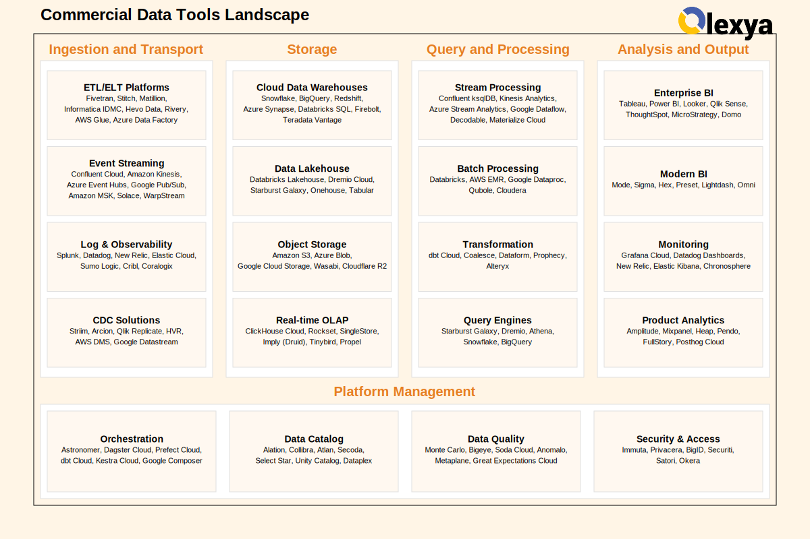

# Solutions Commerciales - Data Tools Landscape

> **Objectif:** Recenser et classifier les solutions commerciales/propriétaires du marché pour construire une plateforme de données.

---

## 🖼️ Vue d'Ensemble

---

## 📚 Structure du Répertoire

Ce répertoire reprend la **même organisation** que les solutions open-source, adaptée aux outils commerciaux :

| Fichier | Description | Équivalent OSS |
|---------|-------------|----------------|
| [01.ingestion_and_transport.md](01.ingestion_and_transport.md) | ETL/ELT, Streaming, CDC commerciaux | 01.ingestion_and_transport.md |
| [02.storage.md](02.storage.md) | Cloud DW, Lakehouse, Object Storage | 02.storage.md |
| [03.query_and_processing.md](03.query_and_processing.md) | Query engines, Stream/Batch processing | 03.query_and_processing.md |
| [04.analysis_and_output.md](04.analysis_and_output.md) | BI, Dashboards, Web Analytics | 04.analysis_and_output.md |
| [05.platform_management.md](05.platform_management.md) | Orchestration, Governance, Quality | 05.platform_management.md |
| [06.classification_par_flux.md](06.classification_par_flux.md) | Classification Streaming/Micro/Batch | 06.classification_par_flux.md |
| [07.matrice_flux_fonction.md](07.matrice_flux_fonction.md) | Matrice Flux × Fonction | 07.matrice_flux_fonction.md |
| [08.visualisations_classification.md](08.visualisations_classification.md) | Diagrammes et visualisations | 08.visualisations_classification.md |

---

## 🏗️ Organisation Thématique

### Par Catégorie Fonctionnelle

Chaque fichier suit la **même structure** que son équivalent open-source :

#### 01. Ingestion & Transport
- **Data Replication** : Fivetran, Stitch, Matillion, Informatica...
- **Event/Stream Processing** : Confluent, Kinesis, Event Hubs, Pub/Sub...
- **Log Collection** : Splunk, Datadog, Elastic Cloud, Cribl...
- **Change Data Capture** : Striim, Arcion, Qlik Replicate, AWS DMS...

#### 02. Storage
- **File Layer** : S3, Azure Blob, GCS, Wasabi, Cloudflare R2...
- **Object Storage** : NetApp, Dell ECS, Pure Storage...
- **Metadata Layer** : Snowflake, BigQuery, Databricks, Redshift...
- **Data Modeling** : dbt Cloud, Coalesce, Dataform, Prophecy...

#### 03. Query & Processing
- **Query Engine** : Starburst, Dremio, Athena, Firebolt...
- **Stream Processing** : Confluent ksqlDB, Decodable, Materialize...
- **Batch Processing** : Databricks, AWS Glue, dbt Cloud...
- **Dataframe Processing** : Hex, Deepnote, Mode, Databricks Notebooks...
- **Datawarehouse & OLAP** : Snowflake, BigQuery, ClickHouse Cloud...

#### 04. Analysis & Output
- **Framework** : Plotly Enterprise, Highcharts, Sisense.js...
- **High-Code** : Hex, Databricks Notebooks, Mode...
- **Low-Code** : Grafana Cloud, Datadog, Elastic Cloud...
- **No-Code** : Tableau, Power BI, Looker, Qlik...
- **Web Analytics** : Amplitude, Mixpanel, Heap, Segment...

#### 05. Platform Management
- **Data Quality & Testing** : Monte Carlo, Bigeye, Soda Cloud...
- **Governance** : Alation, Collibra, Atlan, Unity Catalog...
- **Automation** : Workato, Zapier, Power Automate...
- **Green IT** : AWS/Azure/GCP Carbon Tools, Watershed...
- **Workflow Manager** : Astronomer, Dagster Cloud, Prefect Cloud...
- **Compliance & Security** : Immuta, Privacera, BigID...

---

## 📊 Classifications

### Par Flux de Données (06)

| Mode | Latence | Leaders Commerciaux |
|------|---------|---------------------|
| 🌊 Streaming | < 1s | Confluent, Kinesis, Striim |
| ⚡ Micro-Batch | 1s-5min | Databricks, Snowflake, Fivetran |
| 📦 Batching | > 5min | Fivetran, dbt Cloud, Snowflake |

### Matrice Flux × Fonction (07)

Vue bidimensionnelle combinant :
- **Axe temporel** : Streaming, Micro-Batching, Batching
- **Axe fonctionnel** : Collecte, Transport, Stockage, Traitement, Analyse, Gouvernance

### Visualisations (08)

Diagrammes Mermaid pour :
- Modern Data Stack Enterprise
- Real-time Analytics Stack
- Databricks Lakehouse Architecture

---

## 🔄 Mapping Open Source → Commercial

| Catégorie | Open Source | Commercial |
|-----------|-------------|------------|
| ETL/ELT | Airbyte | Fivetran |
| CDC | Debezium | Striim, Arcion |
| Streaming | Apache Kafka | Confluent Cloud |
| Storage | MinIO + Iceberg | Snowflake, Databricks |
| Processing | Apache Spark | Databricks |
| Transform | dbt core | dbt Cloud |
| Query | Trino | Starburst Galaxy |
| BI | Apache Superset | Tableau, Looker |
| Monitoring | Grafana | Grafana Cloud |
| Catalog | DataHub | Atlan, Alation |
| Quality | Great Expectations | Monte Carlo |
| Orchestration | Apache Airflow | Astronomer |

---

## 💰 Estimation Budgétaire

| Taille | Budget Annuel | Stack Type |
|--------|---------------|------------|
| Startup (< 50 emp) | ~$30K | Fivetran → Snowflake → dbt → Preset |
| Scale-up (50-200) | ~$220K | + Looker + Monte Carlo + Atlan |
| Enterprise (200+) | ~$1.2M | + Tableau + Collibra + Full observability |

---

## 🔗 Références

- [Solutions Open Source](../README.md)
- [Diagramme Infrastructure OSS](../data_infrastructure.svg)

---

**Document créé le:** 2025-12-15
**Dernière mise à jour:** 2025-12-15
**Version:** 2.0
