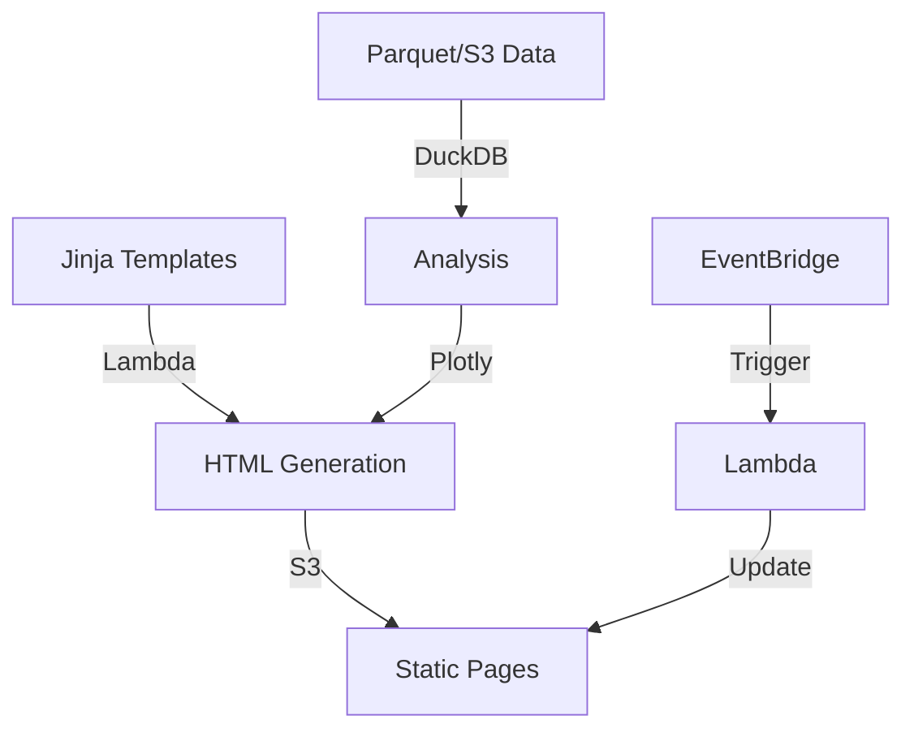

# Static Data Architecture Guide for Small Businesses

## For Companies < $2M Revenue

### Executive Summary

This guide proposes a lightweight and cost-effective data architecture based on static report generation. The approach focuses on:
- Minimal cost (< $50/month)
- Near-zero maintenance
- Serverless approach
- Open-source tools
- Simple interface for end users

### Key Characteristics
- Limited technical resources
- Need for simplicity and easy maintenance
- Preference for managed services
- Strong budget constraints
- Small data volumes (<50GB)
- Small team (<5 people)

### Recommended Solutions

#### 1. Storage & Configuration
| Category | Tool | Features | Best For |
|----------|------|-----------|----------|
| Storage | [AWS S3](https://aws.amazon.com/s3/) | • Object storage<br>• Static hosting<br>• Minimal cost | • Data storage<br>• Page hosting<br>• Configuration |
| Format | [Parquet](https://parquet.apache.org/) | • Efficient compression<br>• Column format<br>• DuckDB support | • Data storage<br>• Efficient querying<br>• Archiving |
| Config | [YAML](https://yaml.org/) | • Readable<br>• Simple structure<br>• Versionable | • Report config<br>• Parameters<br>• Templates |

**YAML Configuration Example:**
```yaml
# config/reports/sales.yaml
title: "Sales Report"
description: "Monthly sales analysis"
update_frequency: "daily"
data_source: "s3://bucket/sales.parquet"
charts:
  - name: "Sales Evolution"
    type: "line"
    query: "SELECT date, SUM(amount) as sales FROM sales GROUP BY 1"
    params:
      x: "date"
      y: "sales"
      title: "Monthly Sales"
```

#### 2. Processing & Analysis
| Category | Tool | Features | Best For |
|----------|------|-----------|----------|
| Database | [DuckDB](https://duckdb.org/) | • In-memory querying<br>• Parquet support<br>• Python integration | • Data analysis<br>• Aggregations<br>• Transformations |
| Processing | [pandas](https://pandas.pydata.org/) | • Data manipulation<br>• Easy integration<br>• Multiple formats | • Data preparation<br>• Calculations<br>• Export |
| Charts | [Plotly](https://plotly.com/) | • Interactive<br>• HTML export<br>• Customizable | • Visualizations<br>• Charts<br>• Dashboards |

**DuckDB Query Example:**
```python
import duckdb

def analyze_sales(start_date):
    query = """
    SELECT 
        date_trunc('month', date) as month,
        sum(amount) as revenue,
        count(distinct customer_id) as customers,
        sum(amount)/count(distinct customer_id) as avg_revenue_per_customer
    FROM read_parquet('s3://bucket/sales.parquet')
    WHERE date >= ?
    GROUP BY 1
    ORDER BY 1
    """
    return duckdb.query(query, [start_date]).df()
```

#### 3. Report Generation
| Category | Tool | Features | Best For |
|----------|------|-----------|----------|
| Templates | [Jinja2](https://jinja.palletsprojects.com/) | • Template inheritance<br>• Macros<br>• Filters | • HTML structure<br>• Reusability<br>• Logic |
| Style | [TailwindCSS](https://tailwindcss.com/) | • Utility CSS<br>• No build<br>• Responsive | • Page styling<br>• Components<br>• Layout |
| Deployment | [AWS Lambda](https://aws.amazon.com/lambda/) | • Serverless<br>• Minimal cost<br>• Automated | • Generation<br>• Publishing<br>• Updates |

**Jinja Template Example:**
```html
{# templates/components/metric_card.html #}
<div class="bg-white rounded-lg shadow p-4">
    <h3 class="text-lg font-semibold text-gray-700">{{ title }}</h3>
    <p class="text-3xl font-bold text-blue-600">{{ value }}</p>
    
    <p class="text-sm {{ 'text-green-600' if change > 0 else 'text-red-600' }}">
        {{ change }}% vs previous month
    </p>
    
</div>


<div class="container mx-auto p-4">
    <h1 class="text-2xl font-bold mb-4">{{ title }}</h1>
    
    <div class="grid grid-cols-1 md:grid-cols-3 gap-4 mb-8">
        
            
        
    </div>
    
    {{ sales_chart | safe }}
</div>

```

### Architecture



### Implementation Guide

1. **Preparation (Week 1)**
   - S3 configuration
   - Folder structure
   - Base templates

2. **Development (Week 2-3)**
   - Analysis scripts
   - Report templates
   - Local testing

3. **Deployment (Week 4)**
   - Lambda configuration
   - Automation
   - Documentation

### Code Examples

1. **Main Lambda Script:**
```python
def lambda_handler(event, context):
    generator = ReportGenerator()
    
    # Generate index
    index_html = generator.generate_report('index.html')
    upload_to_s3(index_html, 'index.html')
    
    # Generate reports
    reports = get_report_configs()
    for report in reports:
        html = generator.generate_report(
            f'reports/{report.template}',
            params=report.params
        )
        upload_to_s3(html, f'reports/{report.id}.html')
```

2. **Generator Class:**
```python
class ReportGenerator:
    def __init__(self):
        self.template_loader = jinja2.FileSystemLoader('templates')
        self.template_env = jinja2.Environment(loader=self.template_loader)
        self.db = duckdb.connect(":memory:")
    
    def generate_report(self, template_name, params=None):
        template = self.template_env.get_template(template_name)
        data = self.get_report_data(params)
        return template.render(data=data, params=params)
```

### Estimated Costs
- S3: ~$1-2/month
- Lambda: free (under free tier)
- Transfer: ~$1-2/month
**Total**: ~$5/month

### Best Practices
1. Version all code
2. Test locally before deployment
3. Monitor costs
4. Document processes
5. Regular data backup

### Resources
- [AWS Lambda Documentation](https://docs.aws.amazon.com/lambda/)
- [DuckDB Documentation](https://duckdb.org/docs/)
- [Jinja Tutorials](https://jinja.palletsprojects.com/tutorials/)
- [TailwindCSS Guide](https://tailwindcss.com/docs)

### Key Considerations
1. Limit page size
2. Optimize queries
3. Handle errors
4. Secure access
5. Maintain templates

Would you like me to detail any specific parts further or add more examples?
