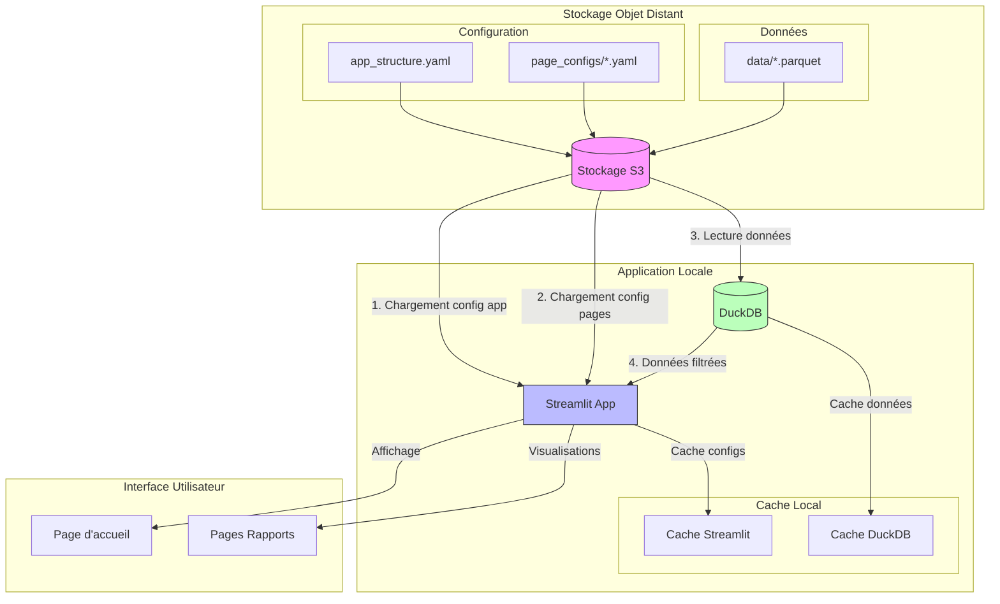

# Local Data Architecture Guide for Small Businesses

## For Companies < $2M Revenue

### Executive Summary

This guide proposes a lightweight data architecture based on local static report generation. The approach focuses on:
- Zero cloud costs
- Local-first approach
- Open-source tools
- Simple configuration
- Git-based version control

### Key Characteristics
- Limited technical resources
- Need for simplicity
- Local development preference
- Zero infrastructure costs
- Small data volumes (<50GB)
- Small team (<5 people)

### Recommended Solutions

#### 1. Data Storage & Access
| Category | Tool | Features | Best For |
|----------|------|-----------|----------|
| Local Storage | [DuckDB](https://duckdb.org/) | • SQLite for analytics<br>• Zero configuration<br>• Python integration | • Local analysis<br>• File querying<br>• Fast processing |
| File Format | [Parquet](https://parquet.apache.org/) | • Efficient compression<br>• Column format<br>• Wide support | • Data storage<br>• Efficient querying<br>• Version control |
| Version Control | [Git LFS](https://git-lfs.github.com/) | • Large file handling<br>• Version tracking<br>• Team collaboration | • Data versioning<br>• File tracking<br>• Distribution |

**Project Structure Example:**
```bash
my-reports/
├── data/
│   ├── sales.parquet
│   └── customers.parquet
├── config/
│   ├── reports/
│   │   ├── sales.yaml
│   │   └── customers.yaml
│   └── app.yaml
├── templates/
│   ├── components/
│   │   └── metric_card.html
│   └── pages/
│       └── sales.html
└── static/
    └── generated/
        └── reports/
```

**Configuration Example:**
```yaml
# config/app.yaml
title: "Company Analytics"
theme: "light"
update_frequency: "daily"
data_path: "./data"
reports:
  - id: "sales"
    title: "Sales Dashboard"
    template: "sales.html"
    data_source: "sales.parquet"
  - id: "customers"
    title: "Customer Analysis"
    template: "customers.html"
    data_source: "customers.parquet"

# config/reports/sales.yaml
title: "Sales Analysis"
description: "Monthly sales performance"
metrics:
  - name: "Total Revenue"
    query: "SELECT sum(amount) FROM sales"
    format: "currency"
  - name: "Customer Count"
    query: "SELECT count(distinct customer_id) FROM sales"
    format: "number"
charts:
  - name: "Monthly Sales"
    type: "line"
    query: """
      SELECT 
        date_trunc('month', date) as month,
        sum(amount) as revenue
      FROM sales 
      GROUP BY 1
      ORDER BY 1
    """
    params:
      x: "month"
      y: "revenue"
      title: "Monthly Revenue"
```

#### 2. Report Generation Engine
| Category | Tool | Features | Best For |
|----------|------|-----------|----------|
| Web Framework | [Streamlit](https://streamlit.io/) | • Python-native<br>• Auto-refresh<br>• Interactive | • Local dashboards<br>• Quick deployment<br>• Rapid development |
| Data Processing | [Polars](https://pola.rs/) | • Fast processing<br>• Memory efficient<br>• Parquet support | • Data transformation<br>• Large files<br>• Quick analysis |
| Visualization | [Plotly](https://plotly.com/) | • Interactive charts<br>• HTML export<br>• Wide variety | • Rich visualizations<br>• Custom charts<br>• Exports |

**Main Application Code:**
```python
import streamlit as st
import yaml
import duckdb
import plotly.express as px
from pathlib import Path
from typing import Dict, Any

class LocalReportGenerator:
    def __init__(self, config_path: str = "config/app.yaml"):
        self.config = self.load_config(config_path)
        self.db = duckdb.connect(":memory:")
        
    def load_config(self, path: str) -> Dict[str, Any]:
        with open(path) as f:
            return yaml.safe_load(f)
    
    def get_report_config(self, report_id: str) -> Dict[str, Any]:
        with open(f"config/reports/{report_id}.yaml") as f:
            return yaml.safe_load(f)
    
    def execute_query(self, query: str) -> pd.DataFrame:
        return self.db.execute(query).fetchdf()
    
    def create_chart(self, chart_config: Dict[str, Any]) -> go.Figure:
        data = self.execute_query(chart_config['query'])
        return px.line(
            data,
            x=chart_config['params']['x'],
            y=chart_config['params']['y'],
            title=chart_config['params']['title']
        )

def main():
    st.set_page_config(page_title="Company Analytics", layout="wide")
    
    # Initialize generator
    generator = LocalReportGenerator()
    
    # Sidebar navigation
    st.sidebar.title("Navigation")
    selected_report = st.sidebar.selectbox(
        "Select Report",
        options=[r['id'] for r in generator.config['reports']],
        format_func=lambda x: next(r['title'] for r in generator.config['reports'] if r['id'] == x)
    )
    
    # Load report config
    report_config = generator.get_report_config(selected_report)
    
    # Display report
    st.title(report_config['title'])
    
    # Display metrics
    cols = st.columns(len(report_config['metrics']))
    for col, metric in zip(cols, report_config['metrics']):
        with col:
            value = generator.execute_query(metric['query']).iloc[0, 0]
            st.metric(metric['name'], value)
    
    # Display charts
    for chart_config in report_config['charts']:
        fig = generator.create_chart(chart_config)
        st.plotly_chart(fig, use_container_width=True)

if __name__ == "__main__":
    main()
```

### Architecture



### Implementation Guide

1. **Setup (Day 1)**
   ```bash
   # Create virtual environment
   python -m venv venv
   source venv/bin/activate
   
   # Install requirements
   pip install streamlit duckdb plotly pyyaml polars
   
   # Create project structure
   mkdir -p {data,config/{reports},templates/{components,pages},static/generated/reports}
   ```

2. **Development (Day 2-3)**
   - Create base configurations
   - Develop report templates
   - Set up data processing

3. **Team Usage (Day 4+)**
   - Share repository
   - Document processes
   - Train team members

### Best Practices
1. Use Git for version control
2. Document configurations
3. Regular data backups
4. Consistent naming conventions
5. Regular code reviews

### Advantages
- Zero infrastructure cost
- Simple deployment
- Easy maintenance
- Quick iterations
- Full control

### Limitations
- Limited to local resources
- Manual updates required
- Team sync via Git
- No real-time data

### Resources
- [DuckDB Documentation](https://duckdb.org/docs/)
- [Streamlit Documentation](https://docs.streamlit.io/)
- [Plotly Documentation](https://plotly.com/python/)
- [Git LFS Documentation](https://git-lfs.github.com/)

### Next Steps
1. Clone repository
2. Configure reports
3. Add data sources
4. Create visualizations
5. Share with team

Would you like me to elaborate on any specific aspect or add more examples?