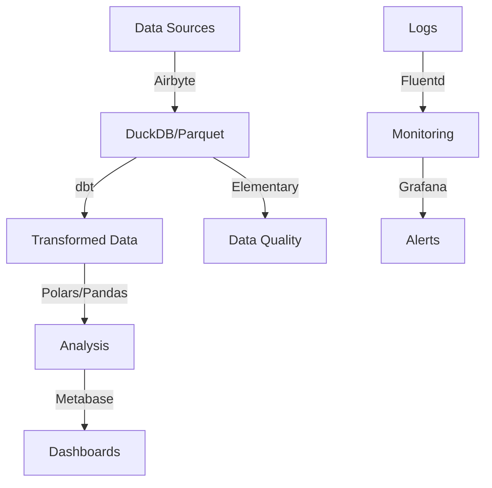

# Small Business Data Stack Guide

## For Companies with Revenue < $2M

### Executive Summary

This guide is designed for small businesses looking to implement a cost-effective, manageable data stack. The focus is on:
- Easy-to-implement solutions
- Minimal maintenance requirements
- Cloud-first approach
- Cost-effective tools
- User-friendly interfaces

### Key Characteristics
- Limited technical resources
- Need for simple and easy-to-maintain solutions
- Preference for managed services
- Budget constraints
- Small data volumes (<100GB)
- Small team size (<10 people)

### Recommended Solutions

#### 1. Data Ingestion & Transport
| Subcategory | Tool | Key Features | Best For |
|-------------|------|--------------|----------|
| ELT Platform | [Airbyte](https://github.com/airbytehq/airbyte) | • Visual interface • 300+ connectors • Cloud option • Community support | • Source integration • Data replication • Cloud sync |
| Pipeline | [Meltano](https://github.com/meltano/meltano) | • Singer taps • Version control • CLI-first • Extensible | • Simple pipelines • Version tracking • Git integration |
| Log Collection | [Fluentd](https://github.com/fluent/fluentd) | • Light footprint • 500+ plugins • Reliable buffering | • Log aggregation • Simple routing • Basic monitoring |

**Implementation Tips:**
- Start with Airbyte for basic data integration
- Use cloud-hosted version when possible
- Implement logging only when needed
- Focus on most critical data sources first

#### 2. Data Storage
| Subcategory | Tool | Key Features | Best For |
|-------------|------|--------------|----------|
| Database | [DuckDB](https://github.com/duckdb/duckdb) | • SQLite for analytics • Zero configuration • Python integration | • Local analysis • CSV/Parquet files • Quick queries |
| File Format | [Parquet](https://github.com/apache/parquet-mr) | • Efficient storage • Wide support • Column-based | • Data files • Analytics storage • Efficient queries |
| Transformation | [dbt Core](https://github.com/dbt-labs/dbt-core) | • SQL transforms • Testing included • Documentation | • Data modeling • SQL transforms • Basic testing |

**Implementation Tips:**
- Use DuckDB for local analytics
- Store data in Parquet format for efficiency
- Start with basic dbt models
- Keep transformation logic simple

#### 3. Processing & Analysis
| Subcategory | Tool | Key Features | Best For |
|-------------|------|--------------|----------|
| DataFrame | [Polars](https://github.com/pola-rs/polars) | • Fast processing • Memory efficient • Python API | • Data processing • Quick analysis • Local compute |
| Analysis | [Pandas](https://github.com/pandas-dev/pandas) | • Rich ecosystem • Easy to learn • Wide support | • Data analysis • Manipulation • Exploration |

**Implementation Tips:**
- Use Pandas for simple analysis
- Switch to Polars for larger datasets
- Keep processing local when possible
- Focus on automation opportunities

#### 4. Visualization & Reporting
| Subcategory | Tool | Key Features | Best For |
|-------------|------|--------------|----------|
| Dashboards | [Streamlit](https://github.com/streamlit/streamlit) | • Python-native • Quick deployment • Interactive | • Internal apps • Quick dashboards • Prototypes |
| BI Platform | [Metabase](https://github.com/metabase/metabase) | • User-friendly • SQL optional • Sharing | • Business users • Self-service BI • Basic reporting |
| Monitoring | [Grafana](https://github.com/grafana/grafana) | • Rich visuals • Alerting • Plugins | • Metrics tracking • KPI monitoring • Basic alerts |

**Implementation Tips:**
- Start with Metabase for business users
- Use Streamlit for custom needs
- Implement Grafana for monitoring
- Focus on most important metrics

#### 5. Data Quality & Management
| Subcategory | Tool | Key Features | Best For |
|-------------|------|--------------|----------|
| Quality | [Elementary](https://github.com/elementary-data/elementary) | • dbt integration • Automated tests • Monitoring | • Data testing • Quality checks • Monitoring |
| Orchestration | [Prefect](https://github.com/PrefectHQ/prefect) | • Python-based • UI included • Cloud option | • Task scheduling • Flow management • Monitoring |

**Implementation Tips:**
- Start with basic dbt tests
- Add Elementary for monitoring
- Use Prefect for simple workflows
- Focus on critical data quality

### Architecture Overview

### Implementation Roadmap

1. **Month 1: Foundation**
   - Set up DuckDB
   - Implement Airbyte for key sources
   - Basic dbt models

2. **Month 2: Analysis**
   - Deploy Metabase
   - Create core dashboards
   - Basic data quality checks

3. **Month 3: Automation**
   - Add Prefect workflows
   - Implement monitoring
   - Set up alerts

4. **Month 4: Optimization**
   - Enhance data models
   - Improve quality checks
   - Add documentation

### Cost Considerations
- Start with free, open-source versions
- Use cloud services selectively
- Focus on essential features
- Monitor resource usage

### Security & Governance
- Implement basic access control
- Regular backups
- Data cleaning procedures
- Simple documentation

### Common Pitfalls to Avoid
1. Over-engineering solutions
2. Too many data sources
3. Complex transformations
4. Insufficient documentation
5. Missing backup procedures

### Success Metrics
- Data freshness
- Query performance
- User adoption
- System uptime
- Issue resolution time

### Support Resources
- GitHub documentation
- Community forums
- Stack Overflow
- Tool-specific Slack channels
- Online tutorials

### Next Steps
1. Assess current data needs
2. Choose initial tools
3. Plan implementation
4. Start small pilot
5. Gradually expand