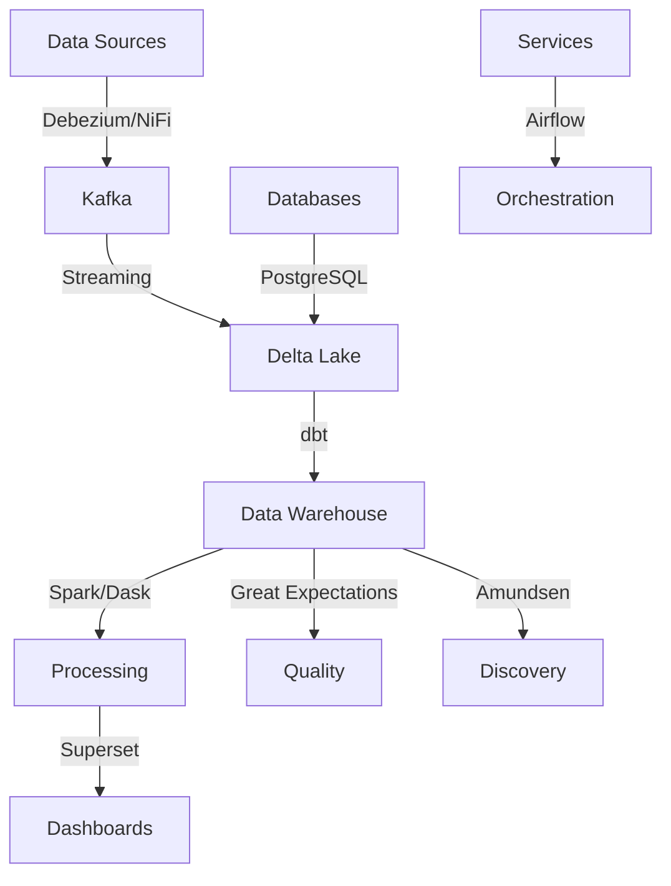

# Medium Business Data Stack Guide
## For Companies with Revenue $2M - $50M

### Executive Summary

This guide is designed for medium-sized businesses ready to implement a more robust data stack. The focus is on:
- Scalable solutions
- Enhanced automation capabilities
- Mix of cloud and on-premise options
- Team collaboration features
- Advanced analytics capabilities

### Key Characteristics
- Growing technical resources
- Dedicated data team (5-20 people)
- Increasing data complexity
- Moderate budget flexibility
- Medium data volumes (100GB-5TB)
- Need for automation
- Multiple data sources

### Recommended Solutions

#### 1. Data Ingestion & Transport
| Subcategory | Tool | Key Features | Best For |
|-------------|------|--------------|----------|
| CDC | [Debezium](https://github.com/debezium/debezium) | • Change data capture • Multiple DB support • Real-time sync | • Database syncing • Real-time updates • Multi-source integration |
| Data Flow | [Apache NiFi](https://github.com/apache/nifi) | • Visual workflows • 200+ processors • Data provenance | • Complex routing • Data transformation • Audit trails |
| CDP | [RudderStack](https://github.com/rudderlabs/rudder-server) | • Event streaming • Identity resolution • Privacy controls | • Customer data • Marketing analytics • User tracking |
| Streaming | [Apache Kafka](https://github.com/apache/kafka) | • High throughput • Scalable • Fault-tolerant | • Event streaming • Message queuing • Log aggregation |

**Implementation Tips:**
- Start with Debezium for database sync
- Use NiFi for complex workflows
- Implement Kafka for real-time needs
- Consider data privacy requirements

#### 2. Data Storage
| Subcategory | Tool | Key Features | Best For |
|-------------|------|--------------|----------|
| Database | [PostgreSQL](https://github.com/postgres/postgres) | • ACID compliance • Advanced SQL • Extensions | • Transactional data • Complex queries • Structured data |
| Lake Format | [Delta Lake](https://github.com/delta-io/delta) | • ACID transactions • Time travel • Schema evolution | • Data lakes • Version control • Large datasets |
| Transformation | [dbt](https://github.com/dbt-labs/dbt-core) | • Modular SQL • Testing framework • Documentation | • Data modeling • Transformations • Documentation |

**Implementation Tips:**
- Use PostgreSQL for core databases
- Implement Delta Lake for data lake
- Build modular dbt models
- Plan for data growth

#### 3. Processing & Analysis
| Subcategory | Tool | Key Features | Best For |
|-------------|------|--------------|----------|
| Compute | [Apache Spark](https://github.com/apache/spark) | • Distributed processing • Multiple APIs • ML support | • Big data processing • Analytics • ML workloads |
| Parallel | [Dask](https://github.com/dask/dask) | • Parallel computing • Pandas API • Distributed | • Python scaling • Parallel compute • Large datasets |
| DataFrame | [Polars](https://github.com/pola-rs/polars) | • High performance • Memory efficient • Python/Rust | • Fast analytics • Data processing • ETL jobs |

**Implementation Tips:**
- Use Spark for large-scale processing
- Implement Dask for Python scaling
- Consider Polars for ETL
- Plan compute resources carefully

#### 4. Visualization & Reporting
| Subcategory | Tool | Key Features | Best For |
|-------------|------|--------------|----------|
| BI | [Apache Superset](https://github.com/apache/superset) | • Modern interface • SQL lab • Rich visualizations | • Data exploration • Dashboards • SQL analytics |
| Reporting | [Evidence](https://github.com/evidence-dev/evidence) | • SQL-based • Version control • Modern stack | • Technical reports • Documentation • SQL insights |
| Monitoring | [Grafana](https://github.com/grafana/grafana) | • Multi-source • Alerting • Plugin system | • Metrics • Dashboards • Observability |

**Implementation Tips:**
- Deploy Superset for business users
- Use Evidence for technical reporting
- Set up Grafana for monitoring
- Define clear ownership

#### 5. Platform Management
| Subcategory | Tool | Key Features | Best For |
|-------------|------|--------------|----------|
| Testing | [Great Expectations](https://github.com/great-expectations/great_expectations) | • Data validation • Quality docs • Test suites | • Data quality • Testing • Documentation |
| Orchestration | [Apache Airflow](https://github.com/apache/airflow) | • DAG workflows • Rich ecosystem • Monitoring | • Pipeline orchestration • Task scheduling • Dependencies |
| Discovery | [Amundsen](https://github.com/amundsen-io/amundsen) | • Data discovery • Search & metadata • Lineage | • Data catalog • Documentation • Discovery |

**Implementation Tips:**
- Implement comprehensive testing
- Build robust workflows
- Enable data discovery
- Focus on documentation

### Architecture Overview

### Implementation Roadmap

1. **Quarter 1: Foundation**
   - Deploy PostgreSQL/Delta Lake
   - Set up data ingestion
   - Implement basic transformations

2. **Quarter 2: Processing**
   - Configure Spark/Dask
   - Build core pipelines
   - Deploy BI tools

3. **Quarter 3: Management**
   - Implement orchestration
   - Set up monitoring
   - Deploy testing framework

4. **Quarter 4: Optimization**
   - Add data discovery
   - Enhance automation
   - Implement governance

### Security & Governance
- Role-based access control
- Data encryption
- Audit logging
- Privacy compliance
- Data lineage tracking

### Cost Optimization
- Resource monitoring
- Scaling policies
- Storage tiering
- Compute optimization
- License management

### Team Organization
- Data Engineers
- Analysts
- Data Scientists
- Platform Engineers
- Business Users

### Success Metrics
- Pipeline reliability
- Query performance
- Data freshness
- User adoption
- System availability
- Issue resolution time

### Risk Management
1. Data quality monitoring
2. Security compliance
3. Resource scalability
4. System redundancy
5. Disaster recovery

### Next Steps
1. Assess current architecture
2. Identify key requirements
3. Plan phased implementation
4. Build proof of concepts
5. Train team members