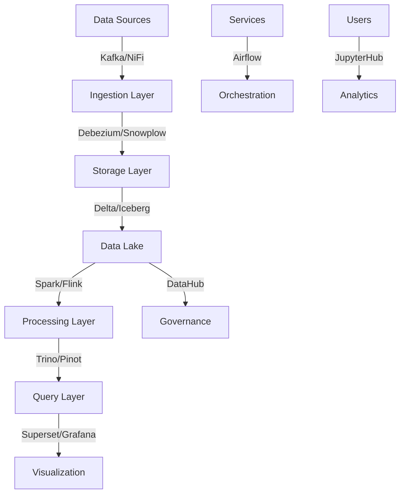

# Enterprise Data Stack Guide
## For Companies with Revenue $50M - $1.5B

### Executive Summary

This guide is designed for enterprises requiring robust, scalable data infrastructure. The focus is on:
- High scalability solutions
- Enterprise-grade security
- Advanced automation
- Comprehensive governance
- Multi-team collaboration

### Key Characteristics
- Multiple data teams
- Complex data requirements
- Significant data volumes (5TB-100TB)
- High availability needs
- Strict compliance requirements
- Multi-environment setup
- Global operations

### Recommended Solutions

#### 1. Data Ingestion & Transport
| Subcategory | Tool | Key Features | Best For |
|-------------|------|--------------|----------|
| Streaming | [Apache Kafka](https://github.com/apache/kafka) | • Enterprise messaging • Global replication • High throughput | • Event streaming • Global distribution • Mission-critical data |
| CDC | [Debezium](https://github.com/debezium/debezium) | • Multi-database CDC • Cloud native • High reliability | • Database syncing • Real-time capture • Cross-database replication |
| Flow Control | [Apache NiFi](https://github.com/apache/nifi) | • Enterprise dataflow • Full provenance • Security focus | • Complex routing • Data governance • Audit requirements |
| Event Analytics | [Snowplow](https://github.com/snowplow/snowplow) | • Custom schemas • Data validation • Multi-cloud | • Behavioral data • Custom analytics • Rich data collection |
| Message Queue | [RabbitMQ](https://github.com/rabbitmq/rabbitmq-server) | • Enterprise messaging • Multiple protocols • High availability | • Service integration • Async messaging • Reliable delivery |

#### 2. Data Storage
| Subcategory | Tool | Key Features | Best For |
|-------------|------|--------------|----------|
| Lake Format | [Delta Lake](https://github.com/delta-io/delta) | • ACID transactions • Schema evolution • Time travel | • Data lakes • Compliance needs • Historical analysis |
| Table Format | [Apache Iceberg](https://github.com/apache/iceberg) | • Schema evolution • Partition evolution • Transactions | • Large tables • Complex analytics • Cloud storage |
| Stream Storage | [Apache Hudi](https://github.com/apache/hudi) | • Incremental processing • Upserts/Deletes • Optimization | • Real-time data • Incremental ETL • Large datasets |
| OLAP Storage | [ClickHouse](https://github.com/ClickHouse/ClickHouse) | • Column storage • High performance • Real-time OLAP | • Analytics queries • Time series • Large volumes |

#### 3. Processing & Analysis
| Subcategory | Tool | Key Features | Best For |
|-------------|------|--------------|----------|
| Batch Processing | [Apache Spark](https://github.com/apache/spark) | • Distributed compute • ML pipelines • Multi-language | • Big data processing • ML workflows • Complex ETL |
| Stream Processing | [Apache Flink](https://github.com/apache/flink) | • Stateful compute • Event time • Exactly-once | • Real-time analytics • Event processing • Streaming ETL |
| Query Engine | [Trino](https://github.com/trinodb/trino) | • Distributed SQL • Multiple sources • Federation | • Ad-hoc queries • Data federation • Interactive analysis |
| OLAP Engine | [Apache Pinot](https://github.com/apache/pinot) | • Real-time analytics • Low latency • High throughput | • User-facing analytics • Real-time insights • High concurrency |

#### 4. Analysis & Visualization
| Subcategory | Tool | Key Features | Best For |
|-------------|------|--------------|----------|
| BI Platform | [Apache Superset](https://github.com/apache/superset) | • Enterprise features • SQL lab • Custom viz | • Self-service BI • Data exploration • Custom analytics |
| Monitoring | [Grafana](https://github.com/grafana/grafana) | • Enterprise monitoring • Advanced alerts • Role-based access | • Metrics tracking • SLA monitoring • System observability |
| Notebooks | [JupyterHub](https://github.com/jupyterhub/jupyterHub) | • Multi-user • Authentication • Resource management | • Data science • Team collaboration • Interactive analysis |
| Custom Apps | [Plotly Dash](https://github.com/plotly/dash) | • Interactive apps • React components • Enterprise features | • Custom dashboards • Data apps • Interactive reports |

#### 5. Platform Management
| Subcategory | Tool | Key Features | Best For |
|-------------|------|--------------|----------|
| Orchestration | [Apache Airflow](https://github.com/apache/airflow) | • Enterprise workflows • SLA monitoring • Multi-team | • Complex pipelines • Task scheduling • Dependencies |
| Data Quality | [Great Expectations](https://github.com/great-expectations/great_expectations) | • Enterprise validation • Custom checks • CI integration | • Data validation • Quality monitoring • Testing framework |
| Discovery | [DataHub](https://github.com/datahub-project/datahub) | • Metadata management • Lineage tracking • Discovery | • Data catalog • Governance • Compliance |
| Metadata | [OpenMetadata](https://github.com/open-metadata/OpenMetadata) | • Data discovery • Quality metrics • Collaboration | • Metadata management • Team collaboration • Data insights |

### Architecture Overview

### Implementation Framework

1. **Foundation (3-6 months)**
   - Core infrastructure setup
   - Basic data pipelines
   - Essential governance

2. **Scale (6-9 months)**
   - Advanced processing
   - Enhanced automation
   - Extended monitoring

3. **Optimization (9-12 months)**
   - Performance tuning
   - Security hardening
   - Advanced governance

4. **Innovation (12+ months)**
   - Advanced analytics
   - Custom applications
   - ML/AI integration

### Security Controls
- Data encryption (at rest/in transit)
- Role-based access control (RBAC)
- Audit logging
- Compliance monitoring
- Security scanning
- Access reviews

### Governance Framework
1. **Data Quality**
   - Quality metrics
   - Validation rules
   - Monitoring
   - Alerting

2. **Metadata Management**
   - Data catalog
   - Lineage tracking
   - Impact analysis
   - Documentation

3. **Compliance**
   - Policy enforcement
   - Privacy controls
   - Regulatory compliance
   - Audit trails

4. **Operations**
   - SLA monitoring
   - Resource management
   - Cost optimization
   - Performance tracking

### Team Structure
- Platform Engineers
- Data Engineers
- Data Scientists
- Analytics Engineers
- Business Analysts
- Data Architects

### Success Metrics
1. **Technical**
   - System uptime
   - Query performance
   - Pipeline reliability
   - Resource utilization

2. **Business**
   - Time to insight
   - Data accessibility
   - User adoption
   - Cost efficiency

### Risk Management
1. **Technical Risks**
   - System failures
   - Performance issues
   - Security breaches
   - Data loss

2. **Operational Risks**
   - Resource constraints
   - Skill gaps
   - Vendor dependencies
   - Technical debt

3. **Business Risks**
   - Cost overruns
   - Adoption challenges
   - Compliance issues
   - Project delays