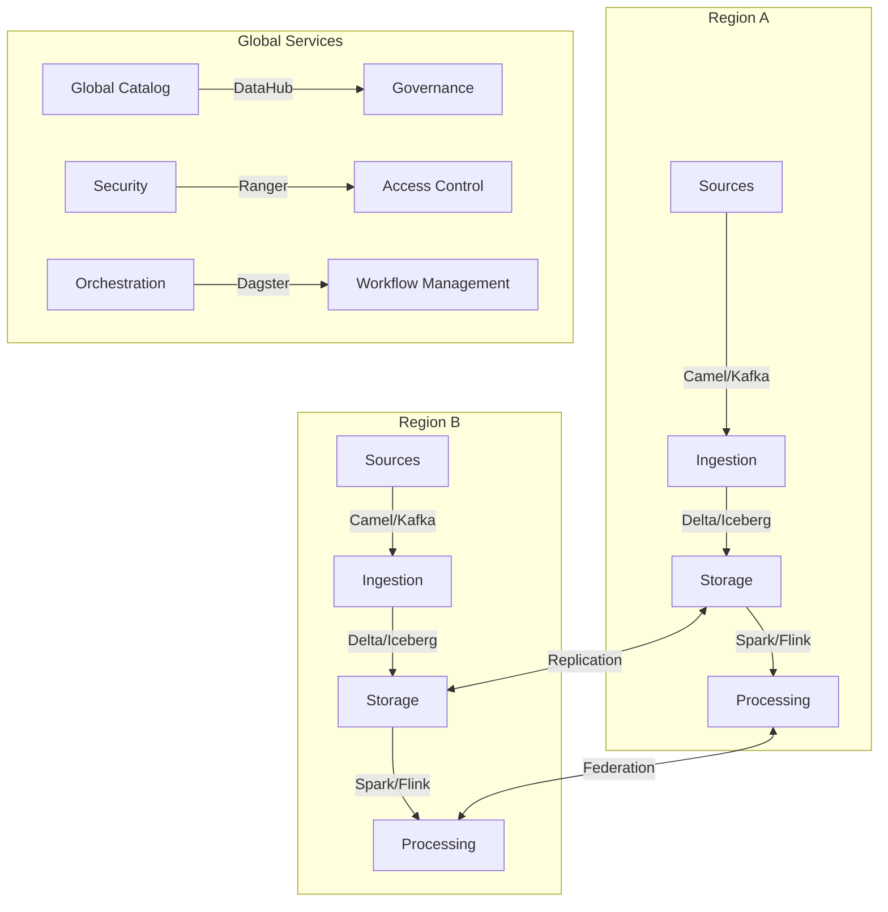

# Large Enterprise Data Stack Guide
## For Companies with Revenue > $1.5B

### Executive Summary

This guide is designed for large enterprises requiring highly scalable, mission-critical data infrastructure. The focus is on:
- Global scale operations
- Mission-critical reliability
- Comprehensive security
- Advanced governance
- Multi-region deployment
- Complete data lifecycle management

### Key Characteristics
- Multiple specialized data teams
- Global data operations
- Massive data volumes (100TB+)
- Complex compliance requirements
- Multi-region presence
- Mission-critical systems
- Enterprise-wide integration

### Recommended Solutions

#### 1. Data Ingestion & Transport
| Subcategory | Tool | Key Features | Best For |
|-------------|------|--------------|----------|
| Enterprise Integration | [Apache Camel](https://github.com/apache/camel) | • Enterprise patterns • Multi-protocol • Extensive connectors | • System integration • Protocol bridging • Enterprise messaging |
| Global Streaming | [Apache Kafka](https://github.com/apache/kafka) | • Global replication • Multi-datacenter • Exactly-once delivery | • Global event streaming • Mission-critical data • High availability |
| CDC Platform | [Debezium](https://github.com/debezium/debezium) | • Multi-database CDC • Global scale • Cloud-native | • Database synchronization • Cross-region replication • Real-time capture |
| Flow Management | [Apache NiFi](https://github.com/apache/nifi) | • Global dataflow • Site-to-site • Full audit | • Complex routing • Secure transfer • Compliance tracking |
| Event Analytics | [Snowplow](https://github.com/snowplow/snowplow) | • Enterprise schemas • Multi-cloud • Custom validation | • Behavioral analytics • Multi-region tracking • Custom events |

#### 2. Data Storage
| Subcategory | Tool | Key Features | Best For |
|-------------|------|--------------|----------|
| Lake Storage | [Delta Lake](https://github.com/delta-io/delta) | • ACID transactions • Multi-cluster • Time travel | • Enterprise lake • Compliance needs • Global operations |
| Table Format | [Apache Iceberg](https://github.com/apache/iceberg) | • Global tables • Schema evolution • Snapshot isolation | • Multi-region tables • Large-scale analytics • Cloud storage |
| Stream Tables | [Apache Hudi](https://github.com/apache/hudi) | • Global upserts • Incremental processing • Optimization | • Real-time data • Global updates • Large datasets |
| OLAP Storage | [StarRocks](https://github.com/StarRocks/starrocks) | • MPP engine • Real-time analytics • High concurrency | • Enterprise OLAP • Real-time queries • High performance |

#### 3. Processing & Analysis
| Subcategory | Tool | Key Features | Best For |
|-------------|------|--------------|----------|
| Distributed Processing | [Apache Spark](https://github.com/apache/spark) | • Global compute • Resource management • Enterprise ML | • Enterprise analytics • Global processing • ML pipelines |
| Stream Processing | [Apache Flink](https://github.com/apache/flink) | • Stateful compute • Global state • Event time | • Global streaming • Real-time analytics • Complex events |
| Query Federation | [Trino](https://github.com/trinodb/trino) | • Global queries • Federation • Cost control | • Cross-source analytics • Data federation • Cost optimization |
| Real-time Analytics | [Apache Pinot](https://github.com/apache/pinot) | • Low latency • Global scale • High availability | • User-facing analytics • Global deployment • Real-time insights |

#### 4. Platform Management
| Subcategory | Tool | Key Features | Best For |
|-------------|------|--------------|----------|
| Orchestration | [Dagster](https://github.com/dagster-io/dagster) | • Asset management • Multi-team • Observability | • Enterprise pipelines • Team collaboration • Asset tracking |
| Workflow Engine | [Argo Workflows](https://github.com/argoproj/argo-workflows) | • Kubernetes native • Global scale • GitOps | • Container workflows • Cloud native • GitOps practices |
| Data Quality | [Great Expectations](https://github.com/great-expectations/great_expectations) | • Enterprise validation • Global rules • Compliance | • Quality framework • Global standards • Compliance checks |
| Automation | [n8n](https://github.com/n8n-io/n8n) | • Enterprise automation • Multi-environment • Custom nodes | • Process automation • Integration flows • Custom workflows |

#### 5. Governance & Security
| Subcategory | Tool | Key Features | Best For |
|-------------|------|--------------|----------|
| Metadata Platform | [DataHub](https://github.com/datahub-project/datahub) | • Global catalog • Enterprise metadata • Compliance | • Data discovery • Governance • Compliance management |
| Data Governance | [Apache Atlas](https://github.com/apache/atlas) | • Classification • Policy enforcement • Auditing | • Enterprise governance • Regulatory compliance • Risk management |
| Security | [Apache Ranger](https://github.com/apache/ranger) | • Access control • Policy management • Audit logging | • Security enforcement • Compliance control • Access management |
| Privacy | [OpenMetadata](https://github.com/open-metadata/OpenMetadata) | • Privacy catalog • PII scanning • Compliance | • Privacy management • Data classification • Regulatory compliance |

### Global Architecture Overview

### Implementation Phases

1. **Foundation (6-12 months)**
   - Global infrastructure setup
   - Core systems deployment
   - Basic governance framework

2. **Scale (12-18 months)**
   - Multi-region expansion
   - Advanced automation
   - Enhanced security

3. **Optimization (18-24 months)**
   - Performance tuning
   - Cost optimization
   - Advanced governance

4. **Innovation (24+ months)**
   - AI/ML integration
   - Custom solutions
   - Advanced analytics

### Enterprise Controls

#### Security Framework
- Zero Trust Architecture
- Global IAM integration
- Multi-region encryption
- Advanced threat protection
- Compliance monitoring
- Security automation

#### Governance Structure
1. **Data Management**
   - Global data catalog
   - Master data management
   - Quality framework
   - Lineage tracking

2. **Compliance**
   - Global policies
   - Regional regulations
   - Privacy controls
   - Audit framework

3. **Operations**
   - Global SLAs
   - Disaster recovery
   - Capacity planning
   - Cost management

### Team Organization

#### Core Teams
- Platform Engineering
- Data Infrastructure
- Security & Compliance
- Data Science
- Analytics Engineering
- Business Intelligence

#### Specialized Teams
- ML Operations
- Data Governance
- Solution Architecture
- DevOps/SRE
- Privacy & Compliance

### Success Metrics

#### Technical KPIs
- Global availability
- Cross-region latency
- Processing efficiency
- Query performance
- Security compliance

#### Business KPIs
- Time to market
- Cost efficiency
- User satisfaction
- Innovation rate
- Compliance status

### Risk Management

1. **Global Risks**
   - Regulatory compliance
   - Data sovereignty
   - Security threats
   - System availability

2. **Operational Risks**
   - Service dependencies
   - Resource allocation
   - Technical complexity
   - Change management

3. **Strategic Risks**
   - Technology evolution
   - Market changes
   - Skill availability
   - Cost management

### Next Steps
1. Assess current landscape
2. Define global architecture
3. Plan phased implementation
4. Build pilot programs
5. Scale globally